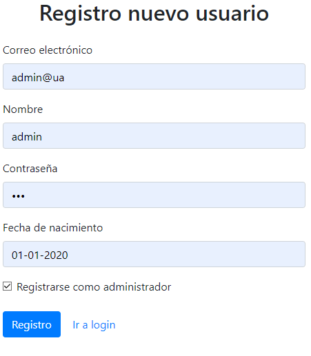

# ToDoList (Práctica 2 MADS)

Repositorio de GitHub:
- (https://github.com/mads-ua-21-22/mads-todolist-CarlosPC94)

Repositorio de Docker: 
- (https://hub.docker.com/repository/docker/cpc73/mads-todolist)

Tablero de trello: 
- (https://trello.com/b/9DIGruu4/todolist-mads)

## Listado de nuevas clases,métodos implementados, plantillas thyemeleaf y explicación de código fuente relevante.

### 1. Página "Acerca de":

Se trata de una página html muy básica donde se informa brevemente de la versión de la aplicación, su fecha de release y el desarrollador.

En la parte superior se encuentra la barra de menú, la cual se explicará detalladamente más adelante.

Código HTML:

~~~
<!DOCTYPE html>
<html xmlns:th="http://www.thymeleaf.org">

<head th:replace="fragments :: head (titulo='Acerca de')"></head>

<body>

  <nav th:replace="fragments :: Menu (${usuario.nombre}, @{/usuarios/{id}/tareas(id=${usuario.id})}, ${usuario.getAdminApproved()})" ></nav>

  <nav th:replace="fragments :: Menu (${null}, @{/login}, ${null})" ></nav>

  

    <h1>ToDoList</h1>
    <ul>
      <li>Desarrollada por Carlos Poveda Cañizares </li>
      <li>Versión 1.0.1 (SNAPSHOT)</li>
      <li>Fecha de release: 12/10/21</li>
    </ul>
  

</body>
</html>
~~~

Como se puede apreciar, es un codigo muy básico, exceptuando la parte de la barra de menú que explicaré con más detalle en el siguiente apartado.

Por último, su controlador está implementado en "HomeCotroller.java":

~~~
@GetMapping("/about")
    public String about(Model model, HttpSession session) {
        Long idUsuario = managerUserSession.usuarioLogeado(session);
        Usuario usuario = null;

        if(idUsuario != null) {
            managerUserSession.comprobarUsuarioLogeado(session, idUsuario);
            usuario = usuarioService.findById(idUsuario);

            model.addAttribute("usuario", usuario);
            model.addAttribute("aux", 0);
            return  "about";

        }
        else {
            model.addAttribute("usuario", usuario);
            model.addAttribute("aux", 1);
            return "about";
        }
    }
~~~

Como podemos ver en el código, lo primero que realizamos es comprobar si hay una sesión inciada, en caso de que sea así devolverá el usuario en cuestión y un auxiliar=0 que utilizaremos como condicion (th:if), o en caso contrario, devolverá un usuario vacío y el auxiliar=1, en ambos cosas nos retornará a la página "about.html".

### 2.Barra de Menú

La barra de menú es común a todas las páginas exceptuando "Login, Registro y Acerca de", en "Login y Registro" no aparecerá la barra, mientras que en "Acerca de" cambiará según si es un usuario logeado o no".

La barra de menú se ha implementado dentro de "fragments.html":

~~~
<!DOCTYPE html>
<html xmlns:th="http://www.thymeleaf.org">

<head th:fragment="head (titulo)">
    <meta charset="UTF-8"/>
    <title th:text="${titulo}"></title>
    <link rel="stylesheet" th:href="@{/css/bootstrap.min.css}">
</head>

<nav th:fragment="Menu (usuario, ruta, admin)" class="navbar navbar-expand-lg navbar-dark bg-primary">
    

        <a class="navbar-brand" href="/about">ToDoList</a>
        <button class="navbar-toggler" type="button" data-bs-toggle="collapse" data-bs-target="#navbarNavDropdown" aria-controls="navbarNavDropdown" aria-expanded="false" aria-label="Toggle navigation">
            
        </button>
        

            <ul class="navbar-nav">
                <li class="nav-item">
                    <a th:if="${usuario != null}" class="nav-link active" aria-current="page" th:href="${ruta}">Tareas</a>
                    <a th:unless="${usuario != null}" class="nav-link active" aria-current="page" th:href="${ruta}">Login</a>
                </li>
                <li class="nav-item" th:if="${admin == true}">
                    <a class="nav-link active" aria-current="page" href="/allusers">Usuarios</a>
                </li>
            </ul>
        

        

            <button type="button" class="btn btn-info dropdown-toggle" data-toggle="dropdown" aria-haspopup="true" aria-expanded="false">
                
            </button>
            

                <button class="dropdown-item" type="button">Cuenta</button>
                

            

        

    

</nav>

    
    
    

</html>
~~~

En primer lugar, a la barra de menú se le pasan 3 parametros "(usuario, ruta, admin)" estos se pasarán desde la pagina donde se carga la barra de menú, por ejemplo desde "listaTareas.html":

~~~
<nav th:replace="fragments :: Menu (${usuario.nombre}, @{/usuarios/{id}/tareas(id=${usuario.id})}, ${usuario.getAdminApproved()})"></nav>
~~~

Con el parametro "usuario" controlamos que el usuario que aparezca en la barra sea el usuario logueado y las rutas sean correctas. Además gracias a estos parametros y al "HomeController" (mostrado en el anterior apartado) y a los "th:if" de la barra de navegación, podemos controlar que la barra de usuario logeado y usuario sin logear sean distintas.

~~~
<a th:if="${usuario != null}" class="nav-link active" aria-current="page" th:href="${ruta}">Tareas</a>
<a th:unless="${usuario != null}" class="nav-link active" aria-current="page" th:href="${ruta}">Login</a>
~~~

### 3.Página de Listado de Usuarios

Se trata de una página donde se muestran todos los usuarios los usuarios registrados en la aplicación, en un principio la aplicación no contaba con diferenciacion y todo el mundo podía acceder a la página de usuarios. Actualmente sólo el administrador puede entrar a la página. Su URL es "/usuarios".

El html "listaUsuarios.html" es el siguiente:

~~~
<!DOCTYPE html>
<html xmlns:th="http://www.thymeleaf.org">

<head th:replace="fragments :: head (titulo='Login')">
  <nav th:replace="fragments :: Menu (${usuario.nombre}, @{/usuarios/{id}/tareas(id=${usuario.id})}, ${usuario.getAdminApproved()})"></nav>
</head>

<body>

  

    

      <table class="table table-striped" >
        <thead>
        <tr>
          <th>Id</th>
          <th>Email</th>
          <th>Nombre</th>
        </tr>
        </thead>
        <tbody>
        <tr th:each="user: ${usuarios}" th:if="${!user.getAdminApproved()}">
          <td th:text="${user.id}"></td>
          <td th:text="${user.email}"></td>
          <td th:text="${user.nombre}"></td>
          <td><a class="btn btn-primary btn-xs" th:href="@{/usuarios/{id}(id=${user.id})}"/>Descripción</a>
          <form method="post" th:action="@{/allusers/{id}(id=${user.id})}">
            <td>
              <button class="btn btn-danger btn-xs" th:if="${user.getAccess()}" th:text="Bloquear" type="submit"/></a>
              <button class="btn btn-danger btn-xs" th:unless="${user.getAccess()}" th:text="Desbloquear" type="submit"/></a>
            </td>
          </form>
        </tr>
        </tbody>
      </table>
    

  

~~~

La parte más destacable de este código html es el siguiente bucle:

~~~
        <tr th:each="user: ${usuarios}" th:if="${!user.getAdminApproved()}">
          <td th:text="${user.id}"></td>
          <td th:text="${user.email}"></td>
          <td th:text="${user.nombre}"></td>
          <td><a class="btn btn-primary btn-xs" th:href="@{/usuarios/{id}(id=${user.id})}"/>Descripción</a>
          <form method="post" th:action="@{/allusers/{id}(id=${user.id})}">
            <td>
              <button class="btn btn-danger btn-xs" th:if="${user.getAccess()}" th:text="Bloquear" type="submit"/></a>
              <button class="btn btn-danger btn-xs" th:unless="${user.getAccess()}" th:text="Desbloquear" type="submit"/></a>
            </td>
          </form>
        </tr>
~~~

Con "th:each" recorremos todos los usuarios (pasados por el controlador) y uno mostramos los datos deseados. Para que el administrador no se vea a si mismo ponemos la condicion "th:if="${!user.getAdminApproved()}"".

Además tenemos la opcion de "bloquear y desbloquear" usuario, que explicaremos más adelante.

Para realizar la llamada a la base de datos utilizamos "UsuarioRepository":

~~~~
public interface UsuarioRepository extends CrudRepository<Usuario, Long> {
    Optional<Usuario> findByEmail(String s);

    @Query(value="select * from usuarios", nativeQuery=true)
    List<Usuario> getUsers();
}
~~~~

No era necesaria la Query asociada a "getUsers()" pero lo supe despues de realizarla por lo que la dejé ya que funcionaba de igual manera.

En "UsuarioService" implementamos la siguiente función:

~~~~
    @Transactional(readOnly = true)
    public List <Usuario> getUsers() {
        return usuarioRepository.getUsers();
    }
~~~~

El controlador se encuentra en "UserController":

~~~~
@GetMapping("/allusers")
    public String usuarios(Model model, HttpSession session) {
        Long idUsuario = managerUserSession.usuarioLogeado(session);
        Usuario usuario = null;
        
        if(idUsuario != null) {
            managerUserSession.comprobarUsuarioLogeado(session, idUsuario);
            usuario = usuarioService.findById(idUsuario);

            if (usuario.getAdminApproved()){
                List <Usuario> usuarios = usuarioService.getUsers();
                model.addAttribute("usuario", usuario);
                model.addAttribute("usuarios", usuarios);

                return "listaUsuarios";
            } else {
                throw new UsuarioServiceException("Sólo el administrador tiene permiso para ver los usuarios");
            }
        }
        else {
            throw new UsuarioNoLogeadoException();
        }

    }
~~~~

Como podemos ver se trata de un Get que comprobará si hay usuario logeado, en caso de que no sea así lanzará un excepción. Para obtener los usuarios llamamos a "userService.getUsers()" y la pasamos como atributo para que pueda ser usada en "listaUsuarios". Además tambien pasamos el "usuario" logueado.

Se puede ver también que está impletada la diferenciación entre usuario normal y administrador, esto lo explicaré más adelante en su sección correspondiente.

### 4. Página de Descripción de Usuario

Se trata de una página básica de información del usuario seleccionado, donde nos aparecen todos sus datos básicos excepto la contraseña.

El html "descripcionUsuario" es el siguiente:

~~~~
<!DOCTYPE html>
<html xmlns:th="http://www.thymeleaf.org">

<head th:replace="fragments :: head (titulo='Login')">
    <nav th:replace="fragments :: Menu (${usuario.nombre}, @{/usuarios/{id}/tareas(id=${usuario.id})}, ${usuario.getAdminApproved()})"></nav>
</head>

<body>
 
    

        

            
Descripción Usuario

            

                <h5 class="card-title">ID Usuario: </h5>
                

                <h5 class="card-title">Nombre Usuario: </h5>
                

                <h5 class="card-title">Email Usuario: </h5>
                

                <h5 class="card-title">Fecha Nacimiento: </h5>
                

            

        

    

</body>
</html>
~~~~

Apenas requiere explicación, simplemente utilizamos el parámetro "usuariodesc" pasado por el controlador con "th:text" para sacar los datos del usuario deseado.

En "UserController" tenemos el siguiente GET;

~~~~
    @GetMapping("/usuarios/{id}")
    public String descripcionUsuario(@PathVariable(value="id") Long idUsuario,
                                     Model model, HttpSession session) {

        Long idUsuariosession = managerUserSession.usuarioLogeado(session);
        managerUserSession.comprobarUsuarioLogeado(session, idUsuariosession);

        Usuario usuario = usuarioService.findById(idUsuariosession);
        Usuario usuariodesc = usuarioService.findById(idUsuario);
        if (usuario == null) {
            throw new UsuarioNotFoundException();
        }

        if (usuario.getAdminApproved()){
            model.addAttribute("usuario", usuario);
            model.addAttribute("usuariodesc", usuariodesc);

            return "descripcionUsuario";
        } else {
            throw new UsuarioServiceException("Sólo el administrador tiene permiso para ver los usuarios");
        }
    }
~~~~

Como podemos ver, el controlador es muy parecido al usado en la lista de usuarios. La diferencia principal es que ahora no pasamos todos los usuarios, pasamos el usuario que ha iniciado sesión y el usuario que hemos seleccionado ("usuariodesc") para acceder a su descripción, cuya "ID" nos viene dentro de la URL que se pasa desde el html "listaUsuarios" en el "th:ref" del boton "Descripcion":

~~~~
<td><a class="btn btn-primary btn-xs" th:href="@{/usuarios/{id}(id=${user.id})}"/>Descripción</a>
~~~~

### 5.Usuario Administración

Se trata de una funcionalidad que nos permite registrarnos como administrador, para ello debe aparecer un checkbox en el registro siempre y cuando no exista otro administrador, en ese caso no deberá aparecer dicho checkbox:

Para implementar esta funcionalidad he tenido que añadir el siguiente atributo en la clase "Usuario":

~~~~
    @Column(columnDefinition="boolean default 'false'")
    private boolean adminApproved;
~~~~

Además de su SET y GET:

~~~~
    public boolean getAdminApproved() {
        return adminApproved;
    }

    public void setAdminApproved(boolean adminApproved) {
        this.adminApproved = adminApproved;
    }
~~~~

También, la siguiente funcion dentro de "UsuarioService":

~~~~
    @Transactional(readOnly = true)
    public int adminExists() {
        int admin = 0;
        int aux = usuarioRepository.getUsers().size();

        for (int i = 0; i < aux; i++){
            if (usuarioRepository.getUsers().get(i).getAdminApproved() == true){
                admin = 1;
            }
        }

        return admin;
    }
~~~~

AdminExists() comprueba si existe algún usuario administrador en nuestra base de datos, en caso de que sea así devolverá 1 o 0 en caso contrario.

En "LoginController" hemos añadido esta función para poder pasarle el resultado al registro y así poder comprobar si existe o no algún admin a la hora de registrarnos:

~~~~
    @GetMapping("/registro")
    public String registroForm(Model model) {
        int adminApproved = usuarioService.adminExists();
        model.addAttribute("access", true);
        model.addAttribute("adminApproved", adminApproved);
        model.addAttribute("registroData", new RegistroData());
        return "formRegistro";
    }
~~~~

Dentro de "formRegistro" usamos la función de la siguiente manera:

~~~~
    

        <input class="form-check-input" type="checkbox" value="TRUE" id="adminApproved" th:field="*{adminApproved}"/>
        <label class="form-check-label" for="adminApproved">
           Registrarse como administrador
        </label>
    

~~~~

Con "th:if" se muestra o no el checkbox dependiendo si existe o no administrador. Si no hay administrador y el usuario selecciona el checkbox este introducirá "true" dentro de "adminApproved", que se recoge en "RegistroData" y lo guardamos en el POST de registro en "LoginController":

~~~~
   @PostMapping("/registro")
   public String registroSubmit(@Valid RegistroData registroData, BindingResult result, Model model) {

        if (result.hasErrors()) {
            return "formRegistro";
        }

        if (usuarioService.findByEmail(registroData.geteMail()) != null) {
            model.addAttribute("registroData", registroData);
            model.addAttribute("error", "El usuario " + registroData.geteMail() + " ya existe");
            return "formRegistro";
        }

        Usuario usuario = new Usuario(registroData.geteMail());
        usuario.setPassword(registroData.getPassword());
        usuario.setFechaNacimiento(registroData.getFechaNacimiento());
        usuario.setNombre(registroData.getNombre());
        usuario.setAdminApproved(registroData.getAdminApproved());

        usuarioService.registrar(usuario);
        return "redirect:/login";
   }
~~~~

Por último, cuando el administrador inicie sesión será dirigido a "listaUsuarios", para ello simplemente se ha añadido esta condición en el POST de "/login" en "LoginController":

~~~~
            if (usuario.getAdminApproved())
                return "redirect:/usuarios";
            else
                return "redirect:/usuarios/" + usuario.getId() + "/tareas";
~~~~

### 6. Protección Listado y Descripción de Usuario

Se ha añadido protección a la lista de usuarios y a la descripción del usuario para que solo el administrador sea capaz de acceder a dichas páginas. Para ello en el "UserController" anteriormente mostrado (secciones: 3 y 4) implementamos la siguiente condición:

~~~~
        if (usuario.getAdminApproved()){
                List <Usuario> usuarios = usuarioService.getUsers();
                model.addAttribute("usuario", usuario);
                model.addAttribute("usuarios", usuarios);

                return "listaUsuarios";
        } else {
                throw new UsuarioServiceException("Sólo el administrador tiene permiso para ver los usuarios");
         }
~~~~

Con esta condición comprobamos que el usuario que intenta acceder a la página de usuarios es el administrador y en caso contrario se lanzará una excepción.

De igual manera implementamos esa misma condición en el controlador de la página de descripción de un usuario:

~~~~
    if (usuario.getAdminApproved()){
            model.addAttribute("usuario", usuario);
            model.addAttribute("usuariodesc", usuariodesc);

            return "descripcionUsuario";
    } else {
            throw new UsuarioServiceException("Sólo el administrador tiene permiso para ver los usuarios");
    }
~~~~

### 7. Administrador Bloqueo Acceso

La última funcionalidad añadida da la posibilidad al administrador de denegar el acceso a los usuarios que considere oportuno.

Para poder implementar esta funcionalidad se ha añadido el atributo "access" a la clase "Usuario":

~~~~
    @Column(columnDefinition="boolean default 'TRUE'")
    private boolean access = true;
~~~~

Junto con su SET y GET:

~~~~
    public boolean getAccess() {
        return access;
    }

    public void setAccess(boolean access) {
        this.access = access;
    }
~~~~

Si "access" el "true" (por defecto) el usuario tendrá acceso a la página, en caso contrario no podrá acceder.

Los botones de "Bloqueo y Desbloqueo" se han añadido en la página de "listaUsuarios":

~~~~
<td>
  <button class="btn btn-danger btn-xs" th:if="${user.getAccess()}" th:text="Bloquear" type="submit"/></a>
  <button class="btn btn-danger btn-xs" th:unless="${user.getAccess()}" th:text="Desbloquear" type="submit"/></a>
</td>
~~~~

Gracias a th:if y th:unless se escoge cuál de los dos mostrar.

En el controlador "UserController" hemos implementado un POST para poder cambiar el acceso a los usuarios:

~~~~
    @PostMapping("/usuarios/{id}")
    public String accesoUsuario(@PathVariable(value="id") Long idUsuario,
                                Model model, HttpSession session) {

        Long idUsuariosession = managerUserSession.usuarioLogeado(session);
        managerUserSession.comprobarUsuarioLogeado(session, idUsuariosession);
        Usuario usuario = usuarioService.findById(idUsuariosession);

        Usuario usuariodesc = usuarioService.findById(idUsuario);
        if (usuariodesc == null) {
            throw new UsuarioNotFoundException();
        }

        usuarioService.changeAccess(idUsuario);
        model.addAttribute("usuario", usuario);

        return "redirect:/usuarios";

    }
~~~~

En primer lugar comprobamos que el usuario existe y si es así llamamos a la función "usuarioService.changeAccess()" que en encargará de cambiar el acceso del usuario dependiendo del que ya tenga actualmente y guardar el usuario en la base de datos con "usuarioRepository.save()":

~~~~
    @Transactional
    public void changeAccess(Long id) {

        Usuario usuario = usuarioRepository.findById(id).orElse(null);;

        if (usuario.getAccess()) {
            usuario.setAccess(false);
        } else {
            usuario.setAccess(true);
        }
        usuarioRepository.save(usuario);
    }
~~~~

Por último, si el usuario tiene el acceso denegado, cuando este intente iniciar sesión aparecerá un mensaje de error indicandole que se le ha denegado el acceso.
Para ello se ha añadido el error "ACCESS_DENIED" dentro de "UsuarioService":

~~~~
public enum LoginStatus {LOGIN_OK, USER_NOT_FOUND, ERROR_PASSWORD, ACCESS_DENIED}
~~~~

Para mostrar el error, se ha añadido una condición dentro de "LoginController", en el POST de "/login":

~~~~
else if (loginStatus == UsuarioService.LoginStatus.ACCESS_DENIED) {
  model.addAttribute("error", "El administrador ha denegado tu acceso");
  return "formLogin";
}
~~~~

## TEST IMPLEMENTADOS

Los test han sido implementados dentro de "UsuarioServiceTest", "UsuarioWebTest" y "TareaWebTest" para aprovechar los Mocks de sesión y no crear más clases de Test.

Test implementados en "TareaWebTest":

### 1. getListaUsuarios()

~~~~
@Test
    public void getListaUsuarios() throws Exception {

        Usuario usuario = new Usuario("Usuario@ua");
        usuario.setId(1L);
        //Añado nombre para que no de error el navbar por usuario.nombre = null;
        usuario.setNombre("Usuario");

        Usuario usuario1 = new Usuario("Usuario1@ua");
        usuario.setId(2L);
        //usuario es admin para poder ver la lista de usuarios.
        usuario.setAdminApproved(true);

        List<Usuario> usuarios = new ArrayList<Usuario>();
        usuarios.add(usuario);
        usuarios.add(usuario1);

        when(usuarioService.getUsers()).thenReturn(usuarios);
        when(usuarioService.findById(0L)).thenReturn(usuario);

        this.mockMvc.perform(get("/usuarios"))
                .andExpect(content().string(allOf(containsString("Usuario1@ua"))));

    }
~~~~

Comprueba que en "listaUsuarios" aparece el usuario que añadimos a la lista manualmente.

### 2. comprobarDescripcionUsuario()

~~~~
    @Test
    public void comprobarDescripcionUsuario() throws Exception {

        Usuario usuario = new Usuario("juan.gutierrez@gmail.com");
        Usuario usuario1 = new Usuario("Usuario1@ua");

        usuario.setId(1L);
        usuario.setNombre("Juan Gutiérrez");
        usuario.setPassword("123");
        //usuario es admin para poder ver la descripcion del usuario1.
        usuario.setAdminApproved(true);
        usuario1.setId(2L);
        usuario1.setNombre("Carlos");
        usuario1.setPassword("123");
        SimpleDateFormat sdf = new SimpleDateFormat("yyyy-MM-dd");
        usuario.setFechaNacimiento(sdf.parse("1997-02-20"));
        usuario1.setFechaNacimiento(sdf.parse("1994-02-20"));

        when(usuarioService.findById(0L)).thenReturn(usuario);
        when(usuarioService.findById(1L)).thenReturn(usuario1);

        this.mockMvc.perform(get("/usuarios/1"))
                .andExpect(content().string(allOf(containsString("Usuario1@ua"),
                        containsString("Carlos"))));
    }
~~~~

Comprueba que en "descripcionUsuario" se muestran los datos del usuario que hemos introducido manualmente.

### 3. getDescripcionUsuarioDevuelveNotFoundCuandoNoExisteUsuario()

~~~~
    @Test
    public void getDescripcionUsuarioDevuelveNotFoundCuandoNoExisteUsuario() throws Exception {

        when(usuarioService.findById(1L)).thenReturn(null);

        this.mockMvc.perform(get("/usuarios/1"))
                .andExpect(status().isNotFound());
    }
~~~~

Comprueba que "descripciónUsuario" devuelve error cuando el usuario no existe.

### 4. comprobarDescripcionUsuarioNoAdmin()

~~~~
    @Test
    public void comprobarDescripcionUsuarioNoAdmin() throws Exception {

        Usuario usuario = new Usuario("juan.gutierrez@gmail.com");
        Usuario usuario1 = new Usuario("Usuario1@ua");

        usuario.setId(1L);
        usuario.setNombre("Juan Gutiérrez");
        usuario.setPassword("123");
        //Igual que el anterior pero sin que el usuario sea admin (tambien se ponia dejar sin poner, es default false)
        usuario.setAdminApproved(false);
        usuario1.setId(2L);
        usuario1.setNombre("Carlos");
        usuario1.setPassword("123");
        SimpleDateFormat sdf = new SimpleDateFormat("yyyy-MM-dd");
        usuario.setFechaNacimiento(sdf.parse("1997-02-20"));
        usuario1.setFechaNacimiento(sdf.parse("1994-02-20"));

        when(usuarioService.findById(0L)).thenReturn(usuario);
        when(usuarioService.findById(1L)).thenReturn(usuario1);

        Assertions.assertThrows(NestedServletException.class, () -> {
            this.mockMvc.perform(get("/usuarios/1"));
        });
    }
~~~~

Comprueba que un usuario no admin no puede entrar a "descripcionUsuario".

### 5. getListaUsuariosNoAdmin()

~~~~
    @Test
    public void getListaUsuariosNoAdmin() throws Exception {

        Usuario usuario = new Usuario("Usuario@ua");
        usuario.setId(1L);
        //Añado nombre para que no de error el navbar por usuario.nombre = null;
        usuario.setNombre("Usuario");

        Usuario usuario1 = new Usuario("Usuario1@ua");
        usuario.setId(2L);

        usuario.setAdminApproved(false);

        List<Usuario> usuarios = new ArrayList<Usuario>();
        usuarios.add(usuario);
        usuarios.add(usuario1);

        when(usuarioService.getUsers()).thenReturn(usuarios);
        when(usuarioService.findById(0L)).thenReturn(usuario);

        Assertions.assertThrows(NestedServletException.class, () -> {
            this.mockMvc.perform(get("/usuarios"));
        });

    }
~~~~

Comprueba que un usuario no admin no puede acceder a la "listaUsuarios".

### 6. getListaUsuariosBotonBloquear()

~~~~
    @Test
    public void getListaUsuariosBotonBloquear() throws Exception {

        Usuario usuario = new Usuario("Usuario@ua");
        usuario.setId(1L);
        //Añado nombre para que no de error el navbar por usuario.nombre = null;
        usuario.setNombre("Usuario");

        Usuario usuario1 = new Usuario("Usuario1@ua");
        usuario.setId(2L);
        //usuario es admin para poder ver la lista de usuarios.
        usuario.setAdminApproved(true);

        List<Usuario> usuarios = new ArrayList<Usuario>();
        usuarios.add(usuario);
        usuarios.add(usuario1);

        when(usuarioService.getUsers()).thenReturn(usuarios);
        when(usuarioService.findById(0L)).thenReturn(usuario);

        this.mockMvc.perform(get("/usuarios"))
                .andExpect(content().string(allOf(containsString("Bloquear"))));

    }
~~~~

Comprueba que aparece el botón de bloquear acceso cuando el usuario tiene el acceso permitido.

### 7. getListaUsuariosBotonDesbloquear()

~~~~
    @Test
    public void getListaUsuariosBotonDesbloquear() throws Exception {

        Usuario usuario = new Usuario("Usuario@ua");
        usuario.setId(1L);
        //Añado nombre para que no de error el navbar por usuario.nombre = null;
        usuario.setNombre("Usuario");

        Usuario usuario1 = new Usuario("Usuario1@ua");
        usuario.setId(2L);
        //usuario es admin para poder ver la lista de usuarios.
        usuario.setAdminApproved(true);
        //Ponemos el acceso en falso para que aparezca el boton desbloquear
        usuario1.setAccess(false);

        List<Usuario> usuarios = new ArrayList<Usuario>();
        usuarios.add(usuario);
        usuarios.add(usuario1);

        when(usuarioService.getUsers()).thenReturn(usuarios);
        when(usuarioService.findById(0L)).thenReturn(usuario);

        this.mockMvc.perform(get("/usuarios"))
                .andExpect(content().string(allOf(containsString("Desbloquear"))));

    }
~~~~

Comprueba que aparece el botón de desbloquear acceso cuando el usuario tiene el acceso denegado.

### 8. getListaUsuariosBarraMenu()

~~~~
    @Test
    public void getListaUsuariosBarraMenu() throws Exception {

        Usuario usuario = new Usuario("Usuario@ua");
        usuario.setId(1L);
        //Añado nombre para que no de error el navbar por usuario.nombre = null;
        usuario.setNombre("Usuario");

        Usuario usuario1 = new Usuario("Usuario1@ua");
        usuario.setId(2L);
        //usuario es admin para poder ver la lista de usuarios.
        usuario.setAdminApproved(true);

        List<Usuario> usuarios = new ArrayList<Usuario>();
        usuarios.add(usuario);
        usuarios.add(usuario1);

        when(usuarioService.getUsers()).thenReturn(usuarios);
        when(usuarioService.findById(0L)).thenReturn(usuario);

        this.mockMvc.perform(get("/usuarios"))
                .andExpect(content().string(allOf(containsString("Tareas"),
                        containsString("Usuario"), containsString("Cerrar Sesión Usuario"))));

    }

~~~~

Comprueba que la barra de menú aparece correctamente para usuarios registrados.

Test implementados dentro de "UsuarioServiceTest":

### 9. comprobarUsuariosLista()

~~~~
    @Test
    public void comprobarUsuariosLista() throws Exception {

        // GIVEN
        Usuario usuario0 = new Usuario("user@ua");
        Usuario usuario = new Usuario("juan.gutierrez@gmail.com");
        Usuario usuario1 = new Usuario("carlos@gmail.com");

        // WHEN
        usuario0.setId(1L);
        usuario0.setNombre("Usuario Ejemplo");
        usuario0.setPassword("123");

        SimpleDateFormat sdf = new SimpleDateFormat("yyyy-MM-dd");
        usuario0.setFechaNacimiento(sdf.parse("2001-02-10"));

        usuario.setId(2L);
        usuario.setNombre("Juan Gutiérrez");
        usuario.setPassword("123");

        usuario.setFechaNacimiento(sdf.parse("1997-02-20"));

        usuario1.setId(3L);
        usuario1.setNombre("Carlos");
        usuario1.setPassword("123");

        usuario1.setFechaNacimiento(sdf.parse("1994-09-20"));
        List<Usuario> usuarios = new ArrayList<Usuario>();
        usuarios.add(usuario0);
        usuarios.add(usuario);
        usuarios.add(usuario1);

        List<Usuario> listaUsuarios = usuarioRepository.getUsers();

        assertThat(listaUsuarios.size()).isEqualTo(usuarios.size());
        assertThat(listaUsuarios.get(0).getId()).isEqualTo(usuarios.get(0).getId());
        assertThat(listaUsuarios.get(0).getNombre()).isEqualTo(usuarios.get(0).getNombre());
        assertThat(listaUsuarios.get(1).getId()).isEqualTo(usuarios.get(1).getId());
        assertThat(listaUsuarios.get(1).getNombre()).isEqualTo(usuarios.get(1).getNombre());
        assertThat(listaUsuarios.get(2).getId()).isEqualTo(usuarios.get(2).getId());
        assertThat(listaUsuarios.get(2).getNombre()).isEqualTo(usuarios.get(2).getNombre());

    }
~~~~

Comprueba que la funcionalidad getUsers() funciona correctamente.

### 10. comprobarAdminExistTrue()

~~~~
    @Test
    public void comprobarAdminExistTrue(){
        Usuario usuario = usuarioService.findByEmail("user@ua");
        usuario.setAdminApproved(true);
        assertThat(usuario.getAdminApproved()).isTrue();
    }
~~~~

Comprueba que la funcionalidad getAdminApproved() funciona correctamente cuando es TRUE.

### 11. comprobarAdminExistFalse()

~~~~
    @Test
    public void comprobarAdminExistFalse(){
        Usuario usuario = usuarioService.findByEmail("user@ua");
        assertThat(usuario.getAdminApproved()).isFalse();
    }
~~~~

Comprueba que la funcionalidad getAdminApproved() funciona correctamente cuando es FALSE (default).

Test implementados en "UsuarioWebTest":

### 12. servicioLoginAdminOK()

~~~~
    @Test
    public void servicioLoginAdminOK() throws Exception {

        Usuario anaGarcia = new Usuario("ana.garcia@gmail.com");
        anaGarcia.setId(1L);
        anaGarcia.setAdminApproved(true);
        anaGarcia.setAccess(true);

        when(usuarioService.login("ana.garcia@gmail.com", "12345678"))
                .thenReturn(UsuarioService.LoginStatus.LOGIN_OK);
        when(usuarioService.findByEmail("ana.garcia@gmail.com"))
                .thenReturn(anaGarcia);

        this.mockMvc.perform(post("/login")
                .param("eMail", "ana.garcia@gmail.com")
                .param("password", "12345678"))
                //.andDo(print())
                .andExpect(status().is3xxRedirection())
                .andExpect(redirectedUrl("/usuarios"));
    }
~~~~

Comprueba que al Iniciar sesión un admin este es correcto y lo redirige a "/usuarios".

### 13. servicioLoginRedirectAccesoDenegado()

~~~~
    @Test
    public void servicioLoginRedirectAccesoDenegado() throws Exception {
        this.mockMvc.perform(get("/login")
                .flashAttr("error", "El administrador ha denegado tu acceso"))
                .andExpect(content().string(containsString("El administrador ha denegado tu acceso")));
    }
~~~~

Comprueba que el error de ACCESS_DENIED se trata correctamente.

### 14. servicioLoginUsuarioAccessDenied()

~~~~
    @Test
    public void servicioLoginUsuarioAccessDenied() throws Exception {
        when(usuarioService.login("ana.garcia@gmail.com", "000"))
                .thenReturn(UsuarioService.LoginStatus.ACCESS_DENIED);

        this.mockMvc.perform(post("/login")
                .param("eMail","ana.garcia@gmail.com")
                .param("password","000"))
                .andExpect(content().string(containsString("El administrador ha denegado tu acceso")));
    }
~~~~

Comprueba que un usuario con acceso denegado no pueda iniciar sesión.

### 15. barraMenuSinRegistro()

~~~~
    @Test
    public void barraMenuSinRegistro() throws Exception {

        this.mockMvc.perform(get("/about"))
                .andExpect(content().string(allOf(containsString("/login"),
                        containsString("ToDoList"))));
    }
~~~~

Comprueba que la barra de menú para usuarios no registrados se muestre correctamente en "Acerca de".