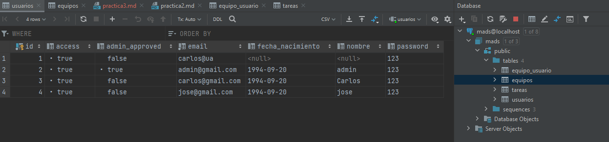
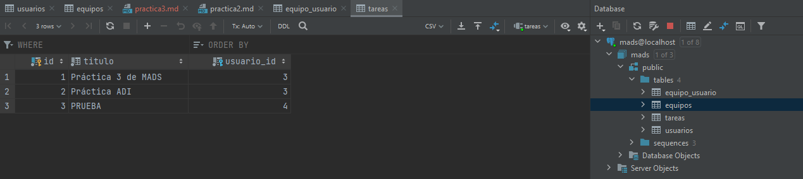
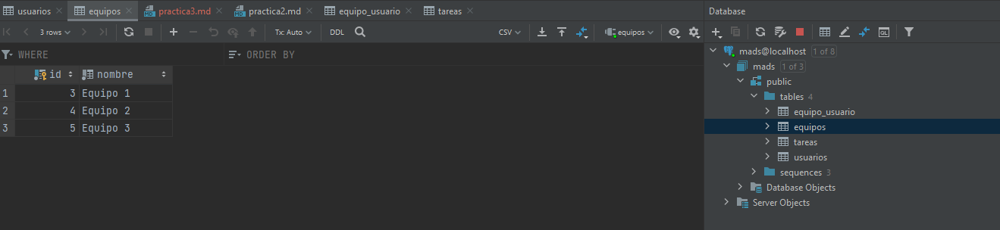
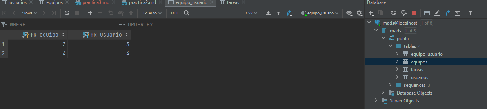
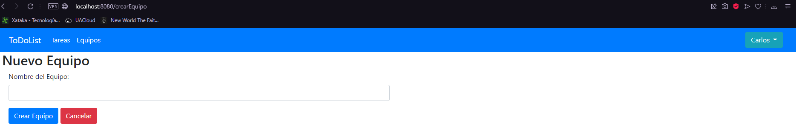

# Integración con GitHub Actions y TDD (Práctica 3 MADS) - Carlos Poveda Cañizares

Repositorio de GitHub:
- (https://github.com/mads-ua-21-22/mads-todolist-CarlosPC94)

Repositorio de Docker:
- (https://hub.docker.com/repository/docker/cpc73/mads-todolist)

Tablero de trello:
- (https://trello.com/b/9DIGruu4/todolist-mads)

## Pantalla de la BBDD Postgres

### 1. Tabla USUARIOS:

### 2. Tabla TAREAS:

### 3. Tabla EQUIPOS:

### 4. Tabla EQUIPO_USUARIO

## Listado de nuevas clases,métodos implementados, plantillas thyemeleaf y explicación de código fuente relevante.

(Se obviarán los puntos anteriores a Pertenencia y Gestión de Equipos)

### 1. Página "Crear Equipo":

En primer lugar, se accede desde la página "listadoEquipos" en el botón "Crear Equipo". La página, como podemos en la imagen, se trata de un formulario básico donde simplemente pondremos el nombre del equipo a crear.

Servicio:

~~~
    @Transactional
    public Equipo crearEquipo(String nombre) {
        Equipo equipo = new Equipo(nombre);
        equipoRepository.save(equipo);
        return equipo;
    }
~~~

Se trata de un método muy sencillo, simplemente creamos un equipo con un nombre pasado por parámetro y lo guardamos con la función save del EquipoRepository.

Controlador:

~~~
    @GetMapping("/crearEquipo")
    public String crearEquipo(Model model, HttpSession session) {
        Long idUsuario = managerUserSession.usuarioLogeado(session);
        Usuario usuario = null;

        if(idUsuario != null) {
            managerUserSession.comprobarUsuarioLogeado(session, idUsuario);
            usuario = usuarioService.findById(idUsuario);

            model.addAttribute("usuario", usuario);

            return "formNuevoEquipo";
        }
        else {
            throw new UsuarioNoLogeadoException();
        }

    }
~~~

Este controlador sería el que nos lleva desde la página de listado de equipos al formulario de creación de equipo. Simplemente se comprueba el usuario logueado y se pasan los modelos.

~~~~
    @PostMapping("/equipos")
    public String nuevoEquipo(Model model, @ModelAttribute EquipoData equipoData,
                              RedirectAttributes flash, HttpSession session) {

        Long idUsuario = managerUserSession.usuarioLogeado(session);
        Usuario usuario = null;

        if(idUsuario != null) {
            managerUserSession.comprobarUsuarioLogeado(session, idUsuario);
            usuario = usuarioService.findById(idUsuario);
            equipoService.crearEquipo(equipoData.getNombre());
            flash.addFlashAttribute("mensaje", "Tarea creada correctamente");;
            model.addAttribute("usuario", usuario);
            return "redirect:/equipos";
        }
        else {
            throw new UsuarioNoLogeadoException();
        }
    }
~~~~

En este controlador, se pasa por parámetro "equipoData", de donde sacamos el nombre del equipo a crear con "equipoData.getNombre()" y llamamos al servicio donde será creado con el método anteriormente mencionado. Luego se nos redirige a la lista de equipos.

HTML más relevante:

~~~
    <form method="post" th:action="@{/equipos}" th:object="${equipoData}">
        

            

                <label for="nombre">Nombre del Equipo:</label>
                <input class="form-control" id="nombre" name="nombre" required  type="text"/>
            

            <button class="btn btn-primary" type="submit">Crear Equipo</button>
            <a class="btn btn-danger btn-xs" th:href="@{/equipos}">Cancelar</a>
        

    </form>
~~~

Como podemos ver, se trata de un formulario con un método post que utiliza "equipoData" para mandar el nombre al controlador. El campo nombre es obligatorio, en caso de no ponerlo no dejará que se cree el equipo.

### 2. Unirse a un Equipo:

