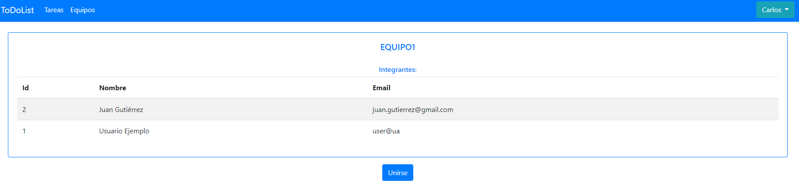
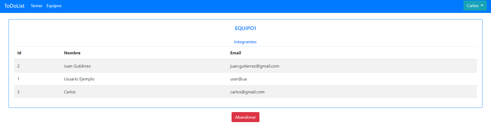
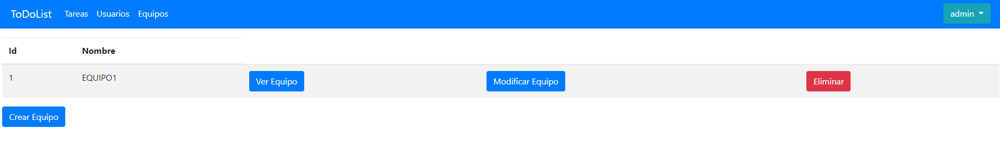

# Integración con GitHub Actions y TDD (Práctica 3 MADS) - Carlos Poveda Cañizares

Repositorio de GitHub:
- (https://github.com/mads-ua-21-22/mads-todolist-CarlosPC94)

Repositorio de Docker:
- (https://hub.docker.com/repository/docker/cpc73/mads-todolist)

Tablero de trello:
- (https://trello.com/b/9DIGruu4/todolist-mads)

## Pantalla de la BBDD Postgres

### 1. Tabla USUARIOS:

### 2. Tabla TAREAS:

### 3. Tabla EQUIPOS:

### 4. Tabla EQUIPO_USUARIO

## Listado de nuevas clases,métodos implementados, plantillas thyemeleaf y explicación de código fuente relevante.

(Se obviarán los puntos anteriores a Pertenencia y Gestión de Equipos)

### 1. Página "Crear Equipo":

En primer lugar, se accede desde la página "listadoEquipos" en el botón "Crear Equipo". La página, como podemos en la imagen, se trata de un formulario básico donde simplemente pondremos el nombre del equipo a crear.

Servicio:

~~~
    @Transactional
    public Equipo crearEquipo(String nombre) {
        Equipo equipo = new Equipo(nombre);
        equipoRepository.save(equipo);
        return equipo;
    }
~~~

Se trata de un método muy sencillo, simplemente creamos un equipo con un nombre pasado por parámetro y lo guardamos con la función save del EquipoRepository.

Controlador:

~~~
    @GetMapping("/crearEquipo")
    public String crearEquipo(Model model, HttpSession session) {
        Long idUsuario = managerUserSession.usuarioLogeado(session);
        Usuario usuario = null;

        if(idUsuario != null) {
            managerUserSession.comprobarUsuarioLogeado(session, idUsuario);
            usuario = usuarioService.findById(idUsuario);

            model.addAttribute("usuario", usuario);

            return "formNuevoEquipo";
        }
        else {
            throw new UsuarioNoLogeadoException();
        }

    }
~~~

Este controlador sería el que nos lleva desde la página de listado de equipos al formulario de creación de equipo. Simplemente se comprueba el usuario logueado y se pasan los modelos.

~~~~
    @PostMapping("/equipos")
    public String nuevoEquipo(Model model, @ModelAttribute EquipoData equipoData,
                              RedirectAttributes flash, HttpSession session) {

        Long idUsuario = managerUserSession.usuarioLogeado(session);
        Usuario usuario = null;

        if(idUsuario != null) {
            managerUserSession.comprobarUsuarioLogeado(session, idUsuario);
            usuario = usuarioService.findById(idUsuario);
            equipoService.crearEquipo(equipoData.getNombre());
            flash.addFlashAttribute("mensaje", "Tarea creada correctamente");;
            model.addAttribute("usuario", usuario);
            return "redirect:/equipos";
        }
        else {
            throw new UsuarioNoLogeadoException();
        }
    }
~~~~

En este controlador, se pasa por parámetro "equipoData", de donde sacamos el nombre del equipo a crear con "equipoData.getNombre()" y llamamos al servicio donde será creado con el método anteriormente mencionado. Luego se nos redirige a la lista de equipos.

HTML más relevante:

~~~
    <form method="post" th:action="@{/equipos}" th:object="${equipoData}">
        

            

                <label for="nombre">Nombre del Equipo:</label>
                <input class="form-control" id="nombre" name="nombre" required  type="text"/>
            

            <button class="btn btn-primary" type="submit">Crear Equipo</button>
            <a class="btn btn-danger btn-xs" th:href="@{/equipos}">Cancelar</a>
        

    </form>
~~~

Como podemos ver, se trata de un formulario con un método post que utiliza "equipoData" para mandar el nombre al controlador. El campo nombre es obligatorio, en caso de no ponerlo no dejará que se cree el equipo.

### 2. Unirse a un Equipo:

Desde la página de descripción de Equipo, podremos unirnos al equipo deseado.

Servicio:

~~~~
    @Transactional
    public Equipo addUsuarioEquipo(Long idEquipo, Long idUser) {
        Equipo equipo = findById(idEquipo);
        Usuario user = usuarioRepository.findById(idUser).orElse(null);
        Set <Usuario> usuarios = new HashSet<Usuario>(equipo.getUsuarios());
        usuarios.add(user);
        equipo.setUsuarios(usuarios);
        Set <Equipo> equipos = new HashSet<Equipo>(user.getEquipos());
        equipos.add(equipo);
        user.setEquipos(equipos);
        equipoRepository.save(equipo);
        usuarioRepository.save(user);
        return equipo;
    }
~~~~

En este método, lo que hacemos es obtener los equipos pertenecientes al usuario y los usuarios pertenecientes al equipo (equipo y usuario los obtenemos gracias a las id pasadas por parámetro), una vez obtenidos los setearemos añadiendo el usuario y el equipo correspondientes. Para finalizar llamaremos a equipoRepository.save() y a usuarioRepository.save() que actualizarán las BBDD.

Controlador:

~~~~
    @PostMapping("/equipos/{id}")
    public String addUserEquipo(@PathVariable(value="id") Long idEquipo,
                                   Model model, @ModelAttribute EquipoData equipoData, HttpSession session) {

        Long idUsuario = managerUserSession.usuarioLogeado(session);
        Usuario usuario = null;

        if(idUsuario != null) {
            managerUserSession.comprobarUsuarioLogeado(session, idUsuario);
            usuario = usuarioService.findById(idUsuario);
            equipoService.addUsuarioEquipo(idEquipo, usuario.getId());
            model.addAttribute("usuario", usuario);
            return "redirect:/equipos/{id}";

        }
        else {
            throw new UsuarioNoLogeadoException();
        }
    }
~~~~

Se trata de un método POST que mediante la id del usuario logueado y la id del equipo pasada por parametro, llamamos al servicio y añadimos el usuario al equipo y el equipo al usuario.

HTML:

~~~~

        

            <form method="post" th:action="@{/equiposdel/{id}(id=${equipo.id})}">
                <button class="btn btn-danger btn-xs"  th:text="Abandonar" type="submit"/></a>
            </form>
        

        

            <form method="post" th:action="@{/equipos/{id}(id=${equipo.id})}">
                <button class="btn btn-primary btn-xs"  th:text="Unirse" type="submit"/></a>
            </form>
        

    

~~~~

Como código más relevante pondré este fragmento, en el cual para decidir si el usuario ve por pantalla "Unirse" o "Abandonar" gracias a las etiquetas th:if y th:unless de thymeleaf que nos dejará comprobar si el equipo está dentro de los equipos de los que el usuario forma parte "usuario.getEquipos().contains(equipo)".

### 3. Abandonar un Equipo:

Al igual que en el anterior apartado, desde la página de descripción de un equipo podremos abandonarlo si formamos parte de este.

Servicio:

~~~~
    @Transactional
    public Equipo borrarUsuarioEquipo(Long idEquipo, Long idUser) {
        Equipo equipo = findById(idEquipo);
        Usuario user = usuarioRepository.findById(idUser).orElse(null);
        Set <Usuario> usuarios = new HashSet<Usuario>(equipo.getUsuarios());
        usuarios.remove(user);
        equipo.setUsuarios(usuarios);
        Set <Equipo> equipos = new HashSet<Equipo>(user.getEquipos());
        equipos.remove(equipo);
        user.setEquipos(equipos);
        equipoRepository.save(equipo);
        usuarioRepository.save(user);
        return equipo;
    }
~~~~

El método es prácticamente idéntico al anterior mostrado, la unica diferencia es que usamos DELETE en lugar de ADD.

Controlador:

~~~~
    @PostMapping("/equiposdel/{id}")
    public String deleteUserEquipo(@PathVariable(value="id") Long idEquipo,
                                Model model, @ModelAttribute EquipoData equipoData, HttpSession session) {

        Long idUsuario = managerUserSession.usuarioLogeado(session);
        Usuario usuario = null;

        if(idUsuario != null) {
            managerUserSession.comprobarUsuarioLogeado(session, idUsuario);
            usuario = usuarioService.findById(idUsuario);
            equipoService.borrarUsuarioEquipo(idEquipo, usuario.getId());
            model.addAttribute("usuario", usuario);
            return "redirect:/equipos/{id}";

        }
        else {
            throw new UsuarioNoLogeadoException();
        }
    }
~~~~

También el controlador es idéntico a diferencia de que llamamos a "equipoService.borrarUsuarioEquipo(idEquipo, usuario.getId())".

El HTML es el mismo que se muestra en el apartado anterior.

### 4. Modificar un Equipo (ADMIN):

El usuario administrador podrá modificar los equipos (cambiar nombre), para ello será dirigido a un formulario, al cual se accede desde el botón "Modificar Equipo" en la lista de equipos.

Servicio:

~~~~
    @Transactional
    public Equipo renombrarEquipo(Long id, String nombre) {
        Equipo equipo = equipoRepository.findById(id).orElse(null);
        equipo.setNombre(nombre);
        equipoRepository.save(equipo);
        return equipo;
    }
~~~~

Se trata de un método muy sencillo, en el cual simplemente pasamos la id del equipo y el nuevo nombre como parámetros. Buscamos el equipo al que corresponde dicha id y seteamos el nombre, un vez seteamos realizamos el ".save()" y la BBDD queda actualizada.

Controlador:

~~~~
    @GetMapping("/editarEquipo/{id}")
    public String editarEquipo(@PathVariable(value="id") Long idEquipo, Model model, HttpSession session) {
        Long idUsuario = managerUserSession.usuarioLogeado(session);
        Usuario usuario = null;

        if(idUsuario != null) {
            managerUserSession.comprobarUsuarioLogeado(session, idUsuario);
            usuario = usuarioService.findById(idUsuario);
            Equipo equipo = equipoService.findById(idEquipo);

            model.addAttribute("usuario", usuario);
            model.addAttribute("equipo", equipo);

            return "formEditarEquipo";
        }
        else {
            throw new UsuarioNoLogeadoException();
        }

    }
~~~~

Este controlador nos redirige al formulario pasando los modelos necesarios para su uso.

~~~~
    @PostMapping("/editequipos/{id}")
    public String renombrarEquipo(@PathVariable(value="id") Long idEquipo,
                                  Model model, @ModelAttribute EquipoData equipoData, HttpSession session) {

        Long idUsuario = managerUserSession.usuarioLogeado(session);
        Usuario usuario = null;

        if(idUsuario != null) {
            managerUserSession.comprobarUsuarioLogeado(session, idUsuario);
            usuario = usuarioService.findById(idUsuario);
            model.addAttribute("usuario", usuario);
            equipoService.renombrarEquipo(idEquipo, equipoData.getNombre());
            return "redirect:/equipos";

        }
        else {
            throw new UsuarioNoLogeadoException();
        }
    }
~~~~

En este controlador además de las funciones habituales, llamamos a "equipoService.renombrarEquipo(idEquipo, equipoData.getNombre())" que se encargará de cambiarle el nombre al equipo cuya ID pasamos por parámetro.
EquipoData contiene el nombre que se pasará desde el formulario en el HTML.

HTML:

~~~~
<td th:if="${usuario.getAdminApproved()}"><a class="btn btn-primary" th:href="@{/editarEquipo/{id}(id=${equipo.id})}" >Modificar Equipo</a></td>
~~~~

En listaEquipo el botón sólo se mostrará si nuestro user es admin (th:if="${usuario.getAdminApproved()}).

~~~~
  <form method="post" th:action="@{/editequipos/{id}(id=${equipo.id})}" th:object="${equipoData}">
    

      

        <label for="nombre">Modificar Equipo: </label>
        <input class="form-control" id="nombre" name="nombre" required  type="text"/>
      

      <button class="btn btn-primary" type="submit">Modificar</button>
      <a class="btn btn-danger btn-xs" th:href="@{/equipos}">Cancelar</a>
    

  </form>
~~~~

Se trata de un formulario idéntico al que hemos anteriormente cuando creamos un equipo, por lo que su explicación es innecesaria.

### 5. Eliminar un Equipo (ADMIN):

Como usuario administrador, también se ha de tener la posibilidad de eliminar equipos.

Servicio:

~~~~
    @Transactional
    public void borrarEquipo(Long id) {
        Equipo equipo = equipoRepository.findById(id).orElse(null);
        equipoRepository.delete(equipo);
    }
~~~~

Simplemente se busca el equipo del cual su id se pasa por parámetro y lo eliminamos con "equipoRepository.delete(equipo)", siendo así eliminado de la BBDD.

Controlador:

~~~~
    @PostMapping("/deleteequipos/{id}")
    public String borrarEquipo(@PathVariable(value="id") Long idEquipo,
                                   Model model, HttpSession session) {

        Long idUsuario = managerUserSession.usuarioLogeado(session);
        Usuario usuario = null;

        if(idUsuario != null) {
            managerUserSession.comprobarUsuarioLogeado(session, idUsuario);
            usuario = usuarioService.findById(idUsuario);
            model.addAttribute("usuario", usuario);
            equipoService.borrarEquipo(idEquipo);
            return "redirect:/equipos";

        }
        else {
            throw new UsuarioNoLogeadoException();
        }
    }
~~~~

Se trata de un método sencillo en el cual llamamos a al método "equipoService.borrarEquipo(idEquipo)" con la id pasada por parámetro en el HTML.

HTML:

~~~~
          <form method="post" th:action="@{/deleteequipos/{id}(id=${equipo.id})}" th:if="${usuario.getAdminApproved()}">
            <td>
              <button class="btn btn-danger btn-xs" th:text="Eliminar" type="submit"/></a>
            </td>
          </form>
~~~~

Como podemos comprobar simplemente se trata de un formulario en el cual pasamos la ID como parámetro. Otra funcion relevante es el th:if que hará que solo se muestre el botón si nuestro usuario es administrador.
