# Práctica 4: Trabajo en equipo con GitFlow y despliegue en producciónURL
## Equipo 14:
### - Adil Akhazzan
### - Carlos Poveda
### - Antero Guarinos

#

Repositorio de GitHub:
- (https://github.com/mads-ua-21-22/todolist-equipo-14.git)

Repositorio de Docker:
- ( https://hub.docker.com/repository/docker/blancozx/mads-todolist-equipo14)

## 1. Nuevo flujo de trabajo para los issues

Siguiendo la metodología propuesta en la práctica, cada uno de los miembros ha abierto y se ha ocupado personalmente de sus issues asignados.

Algunos ejemplos:

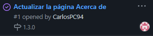
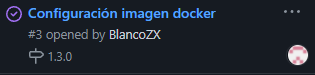
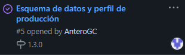

También se han configurado las ramas "main" y "develop" para que al hacer un pull request y se quiera mergear la rama, sea necesario como mínimo la aprobación de unos de los miembros del grupo distinto al que hace el pull request.

Algunos ejemplos:

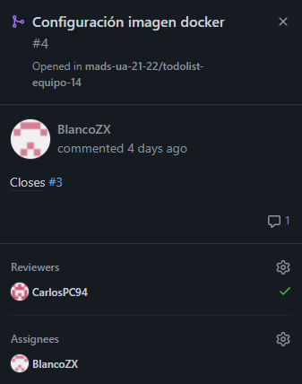
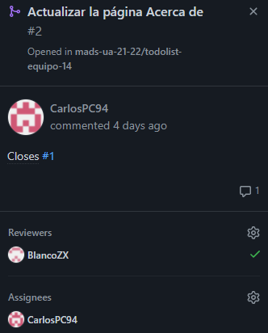
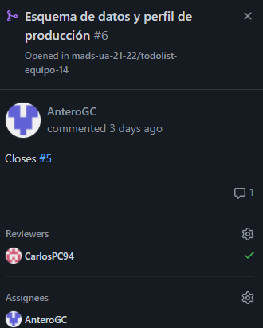

## 2. Contenedor con la aplicación ToDoList

Se ha cambiado el fichero Dockerfile tal y como se especifica en la práctica y se ha modificado el fichero con el perfl postgres para poder usar variables de entorno.

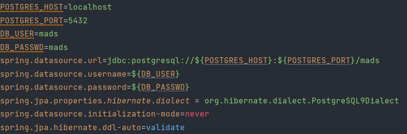

La imagen Docker se ha creado en el perfil de Adil Akhazzan:

~~~~
docker build -t blancozx/mads-todolist-equipoXX:1.3.0-snapshot .
~~~~

Y se ha subido a su repositorio de Docker comprobando que funciona correctamente:

~~~~
docker push blancozx/mads-todolist-equipoXX:1.3.0-snapshot
~~~~

## 3. Despliegue en producción con BD

La red creada en el servidor de la universidad (ssh...) es la siguiente:

~~~~
docker network create network-equipo14
~~~~

Una vez creada la red, se creó el contener y nos conectamos al bash donde configuramos y ponemos en marcha el contenedor de la BBDD de producción tal y como se explica en la práctica. 
Por último, descargamos la imagen Docker anteriormente creada y la inicializmos:

~~~~
docker pull <usuario>/mads-todolist-equipo01:1.3.0-snapshot
docker run --rm --name spring-boot-equipo14 --network network-equipo14 -p8080:8080 blancozx/mads-todolist-equipo01:1.3.0-snapshot --spring.profiles.active=postgres --POSTGRES_HOST=postgres
~~~~

## 4. Perfil de producción y mantenimiento de la base de datos de producción.

Lanzamos el contenedor postgres en /mi-host e inicializamos la aplicación con el perfil postgres. Al hacerlo se crea el esquema de la BBD. Lo generamos y lo guardamos:

~~~~
$ docker exec -it postgres-develop bash
# pg_dump -U mads -s mads > /mi-host/schema-1.2.0.sql
~~~~

Este será el esquema de datos actual de BBDD que lo guardaremos en el directorio sql.

También creamos el fichero con el perfil de producción (igual que el anterior pero con validate) y probamos que funciona con el perfil "postgres-prod" y tambien probamos que valida el esquema de datos. Por último nos conectamos al servidor de la universidad y creamos el backup "backup10112021.sql".

## 5. Desarrollo de la nueva versión con GitFlow.

Desde la rama develop, cada uno de los miembros del grupo desarrolló una nueva "funcionalidad". Dos de las novedades implementadas fueron simplemente cambios estéticos de los botones "Salir" y "Desbloquear", uno para la lista de tareas y otro para la lista de Usuarios.

Botón "salir" lista de Tareas pasa a ser un "Danger":

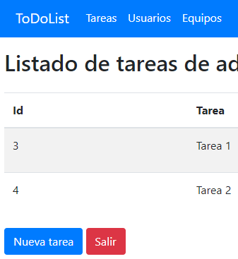
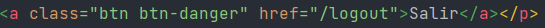

Botón "desbloquear" de lista Usuarios pasa a ser un "Success":

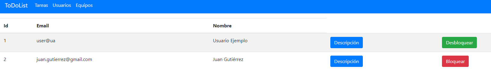
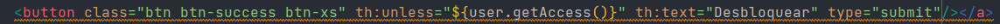

Se trata de funcionalidades sencillas que no requieren explicación.

La tercera y última funcionalidad añadida se trata de añadir una descripción a los equipos. Las modificaciones realizadas son las siguientes:

1. Campo "descripcion" añadido al modelo "Equipo":

~~~~
    private String descripcion;
    
    public String getDescripcion() {
        return descripcion;
    }

    public void setDescripcion(String descripcion) {
        this.descripcion = descripcion;
    }

~~~~

2. Crear Equipo (EquipoService)

Se ha añadido el parámetro descripción y se le asigna al equipo creado mediante su "set":

~~~~
    @Transactional
    public Equipo crearEquipo(String nombre, String descripcion) {
        Equipo equipo = new Equipo(nombre);
        equipo.setDescripcion(descripcion);
        equipoRepository.save(equipo);
        return equipo;
    }
~~~~

3. Modificar Equipo (EquipoService)

Se ha añadido el parámetro descripción y se le asigna al equipo creado mediante su "set":

~~~~
    @Transactional
    public Equipo renombrarEquipo(Long id, String nombre, String descripcion) {
        Equipo equipo = equipoRepository.findById(id).orElse(null);
        equipo.setNombre(nombre);
        equipo.setDescripcion(descripcion);
        equipoRepository.save(equipo);
        return equipo;
    }
~~~~

4. Nuevo Equipo (EquipoController)

Simplemente añadimos el parámetro descripción cuando llamamos al servicio "crearEquipo":

~~~~
    @PostMapping("/equipos")
    public String nuevoEquipo(Model model, @ModelAttribute EquipoData equipoData,
                              RedirectAttributes flash, HttpSession session) {

        Long idUsuario = managerUserSession.usuarioLogeado(session);
        Usuario usuario = null;

        if(idUsuario != null) {
            managerUserSession.comprobarUsuarioLogeado(session, idUsuario);
            usuario = usuarioService.findById(idUsuario);
            equipoService.crearEquipo(equipoData.getNombre(), equipoData.getDescripcion());
            flash.addFlashAttribute("mensaje", "Tarea creada correctamente");;
            model.addAttribute("usuario", usuario);
            return "redirect:/equipos";
        }
        else {
            throw new UsuarioNoLogeadoException();
        }
    }
~~~~

5. Editar Equipo (EquipoController)

Simplemente añadimos el parámetro descripción cuando llamamos al servicio "renombrarEquipo":

~~~~
    @PostMapping("/editequipos/{id}")
    public String renombrarEquipo(@PathVariable(value="id") Long idEquipo,
                                  Model model, @ModelAttribute EquipoData equipoData, HttpSession session) {

        Long idUsuario = managerUserSession.usuarioLogeado(session);
        Usuario usuario = null;

        if(idUsuario != null) {
            managerUserSession.comprobarUsuarioLogeado(session, idUsuario);
            usuario = usuarioService.findById(idUsuario);
            model.addAttribute("usuario", usuario);
            equipoService.renombrarEquipo(idEquipo, equipoData.getNombre(), equipoData.getDescripcion());
            return "redirect:/equipos";

        }
        else {
            throw new UsuarioNoLogeadoException();
        }
    }
~~~~

6. Añadimos campo "descipcion" a EquipoData:

~~~~
package madstodolist.controller;

public class EquipoData {
    private String nombre;
    private String descripcion;

    public String getNombre() {
        return nombre;
    }

    public void setNombre(String nombre) {
        this.nombre = nombre;
    }

    public String getDescripcion() {
        return descripcion;
    }

    public void setDescripcion(String descripcion) {
        this.descripcion = descripcion;
    }
}
~~~~

7. Ahora se muestra la descripción del equipo cuando entramos a "ver equipo":

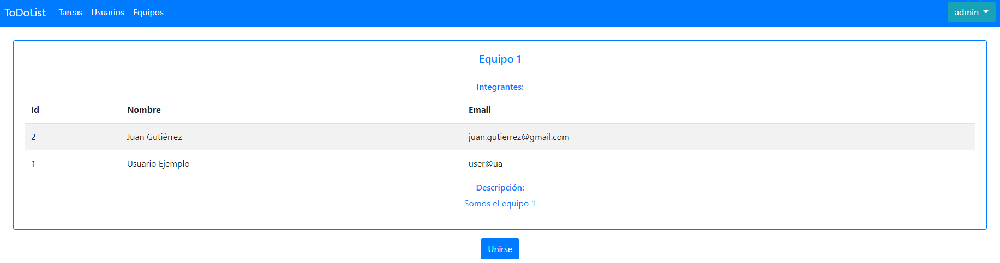

~~~~
  <h6 class="card-subtitle mb-2">Descripción: </h6>
  

~~~~

8. Campo descripción en Editar Equipo:

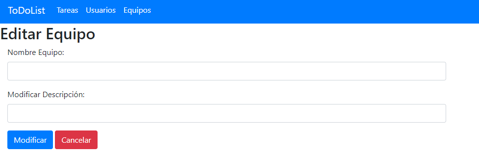

Simplemente se ha añadido el campo descripción al form que ya estaba implementado:

~~~~
  <form method="post" th:action="@{/editequipos/{id}(id=${equipo.id})}" th:object="${equipoData}">
    

      

        <label for="nombre">Nombre Equipo: </label>
        <input class="form-control" id="nombre" name="nombre" required  type="text"/>
      

      

        <label for="descripcion">Modificar Descripción: </label>
        <input class="form-control" id="descripcion" name="descripcion" required  type="text"/>
      

      <button class="btn btn-primary" type="submit">Modificar</button>
      <a class="btn btn-danger btn-xs" th:href="@{/equipos}">Cancelar</a>
    

  </form>
~~~~

9. Campo descripción en Crear Equipo:

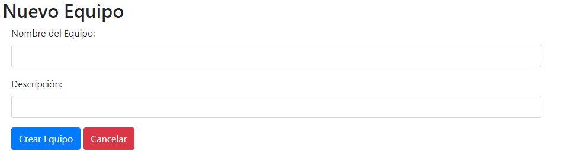

Simplemente se ha añadido el campo descripción al form que ya estaba implementado:

~~~~
    <form method="post" th:action="@{/equipos}" th:object="${equipoData}">
        

            

                <label for="nombre">Nombre del Equipo:</label>
                <input class="form-control" id="nombre" name="nombre" required  type="text"/>
            

            

                <label for="descripcion">Descripción:</label>
                <input class="form-control" id="descripcion" name="descripcion" required  type="text"/>
            

            <button class="btn btn-primary" type="submit">Crear Equipo</button>
            <a class="btn btn-danger btn-xs" th:href="@{/equipos}">Cancelar</a>
        

    </form>
~~~~

Todos estos cambios se desarrollaron e integraron en la rama develop (siendo esta ahora la principal del proyecto, tras la configuración necesaria), y creamos la nueva versión tal y como se especifica en la práctica y de igual manera que hicimos anteriormente, generamos el esquema de datos de la nueva versión y el script de migración.

###TESTS

Tests implementados/modificados para comprobar la nueva funcionalidad:

1. postNuevaEquipoDevuelveRedirectYAñadeEquipo()

~~~~
    @Test
    public void postNuevaEquipoDevuelveRedirectYAñadeEquipo() throws Exception {
        Usuario usuario = new Usuario("domingo@ua.es");
        usuario.setId(1L);
        usuario.setNombre("Usuario");

        when(usuarioService.findById(0L)).thenReturn(usuario);

        this.mockMvc.perform(post("/equipos")
                        .param("nombre", "PRUEBA")
                        .param("descripcion", "X"))
                .andExpect(status().is3xxRedirection())
                .andExpect(redirectedUrl("/equipos"));

        verify(equipoService).crearEquipo("PRUEBA", "X");
    }
~~~~

Simplemente se añade una descripción por parámetro a la hora de crear un equipo y se comprueba.

2. postModificarEquipoDevuelveRedirectYModificaEquipo()

~~~~
    @Test
    public void postModificarEquipoDevuelveRedirectYModificaEquipo() throws Exception {
        Usuario usuario = new Usuario("domingo@ua.es");
        usuario.setId(1L);
        usuario.setNombre("Usuario");
        Equipo equipo = new Equipo("EQUIPO1");
        equipo.setId(1L);

        when(usuarioService.findById(0L)).thenReturn(usuario);

        this.mockMvc.perform(post("/editequipos/1")
                        .param("nombre", "PRUEBA")
                        .param("descripcion", "X"))
                .andExpect(status().is3xxRedirection())
                .andExpect(redirectedUrl("/equipos"));

        verify(equipoService).renombrarEquipo(1L,"PRUEBA", "X");
    }
~~~~

Simplemente se añade una descripción por parámetro a la hora de modificar un equipo y se comprueba.

## 8. Despliegue de la nueva versión y actualización de la BD de producción

El despliegue ha sido realizado por Adil (alu02):
 * En primer lugar nos conectamos al servidor de la universidad con el usuario alu02.
 * Descargamos la ultima versión de la aplicación (https://hub.docker.com/repository/docker/blancozx/mads-todolist-equipo14)
 * Realizamos una copia de seguridad tal y como se ha explicado en el apartado 6 de la práctica.
 * Clonamos el proyecto de git
~~~~
git clone https://github.com/mads-ua-21-22/todolist-equipo-14.git
~~~~
 * Movemos el fichero sql/schema-1.2.0-1.3.0.sql a la raíz del servidor.
 * Migramos la BBDD tal y como se explica en el apartado anterior.
 * Lanzamos el contenedor de la aplicación con el perfil postgres-prod
~~~~

~~~~

#IMPORTANTE

Usuario que ha realizado el despliegue: alu02 (Adil Akhazzan).

Backup de la BBDD de producción:  
 * Nombre: backup221121.sql
 * Ubicación: Carpeta raíz usuario alu02

Script de migracion de la BBDD:
 * Nombre: schema_final.sql
 * Ubicación: Carpeta raíz usuario alu02

Repositorio Docker : https://hub.docker.com/repository/docker/blancozx/mads-todolist-equipo14

