# Práctica 5: Sprint Final
## Equipo 14:
### - Adil Akhazzan
### - Carlos Poveda
### - Antero Guarinos

#

Repositorio de GitHub:
- (https://github.com/mads-ua-21-22/todolist-equipo-14.git)

Repositorio de Docker:
- (https://hub.docker.com/repository/docker/blancozx/mads-todolist-equipo14)

Trello
- (https://trello.com/b/NO2r6D2J/equipo14)

## Metodología Utilizada

En primer lugar, se escogieron las funcionalidades a implementar y se crearon tarjetas en trello donde se indicó su nombre, junto con una breve descripción y fueron clasificadas por dificultad, en nuestro caso las numeramos todas entre 1 y 2.

Una vez escogidas las funcionalidades cada miembro del grupo debía seleccionar la siguiente funcionalidad a realizar, y crear un Google DOC, donde se especificaría la historia de usuario de la funcionalidad junto con sus mockups, y añadir el enlace a la tarjeta de trello asociada a la funcionalidad:

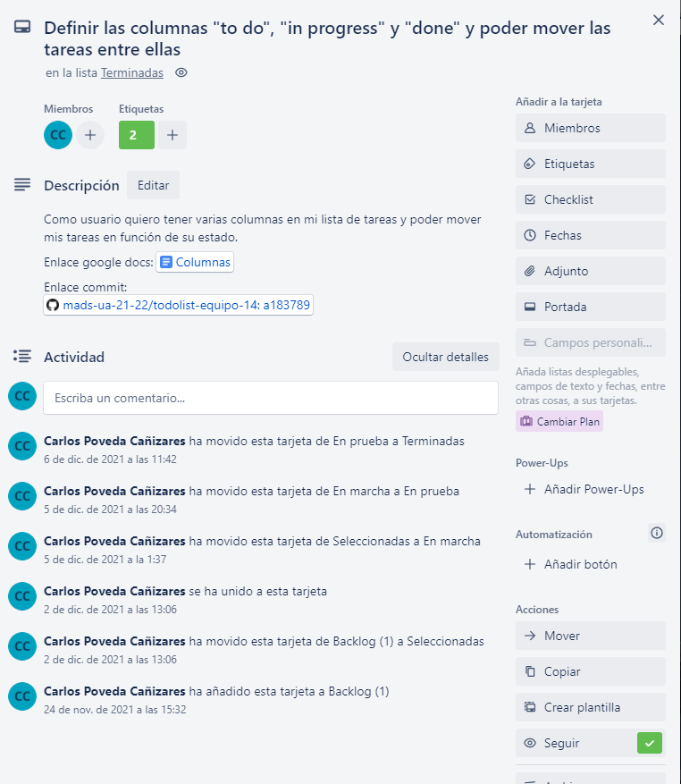

Tras esto la tarjeta de trello se movía a "En marcha" y se procede a crear un ISSUE en Github y la rama donde desarrollaría la funcionalidad, realizando pequeños commits según avanzaba el desarrollo. Al terminar el desarrollo de la funcionalidad, se diseñaron test que comprobar el buen funcionamiento de esta, y una vez que todo funcionara correctamente se realizaba un pull request para mergear la rama de dicha funcionalidad con develop:

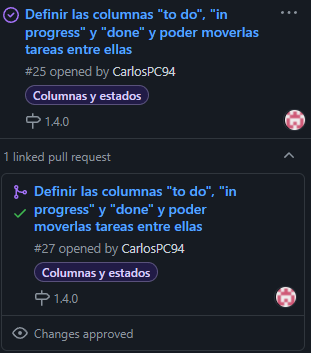

El pull request siempre debía ser aceptado por, como mínimo, uno de los demás miembros del equipo:

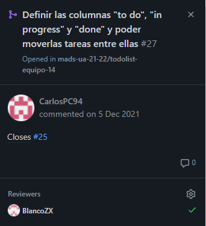

Cuando la rama había sido mergeada, la tarjeta de trello se movía a "En prueba", además se copiaba en enlace de merge a develop en dicha tarjeta, y otro miembro del grupo distinto al desarrollador de la funcionalidad se encargaría de comprobar el funcionamiento de esta haciendo PULL de la rama develop y probando la funcionalidad desarrollada. En caso de encontrar algún fallo se debía crear de nuevo un ISSUE con su respectiva rama para arreglar los errores. Cuando la funcionalidad estaba terminada y completamente funcional, la tarjeta de trello se pasaba a "Terminadas".

##Progresión Semanal (Trello y Github Proyect)

En la primera semana se seleccionaron las funcionalidades como hemos mencionado anteriormente, el tablero de Github estaba vacio, por lo que no se realizó captura:

En la segunda semana tuvimos un problema con las imágenes que fueron sobreescritas por unas capturas realizadas el mismo día, pero se puede ver la actividad gracias al historial de github:

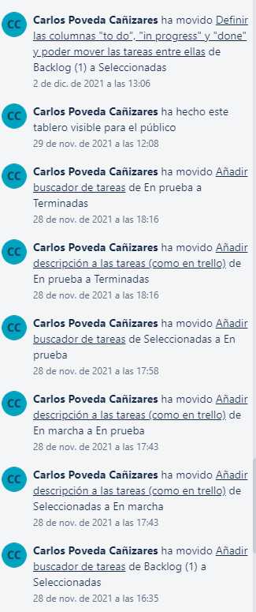 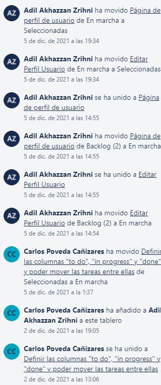 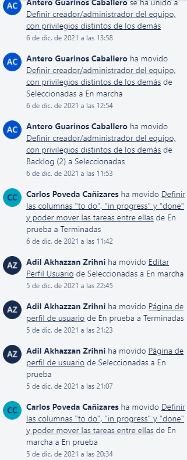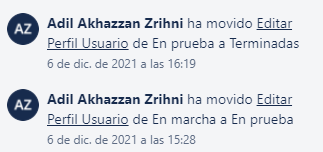

En la tercera semana, el avance fue el siguiente (en algún momento, seguramente con un "miss clic", alguno de nosotros movió la columna "en marcha" delante de "en prueba", nos hemos dado cuenta al hacer la documentación):

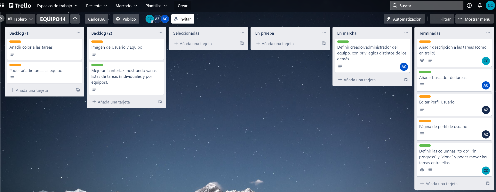  (07/12/21)

En la cuarta semana (13/12/21):

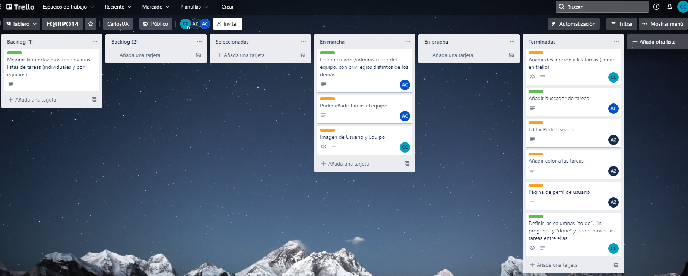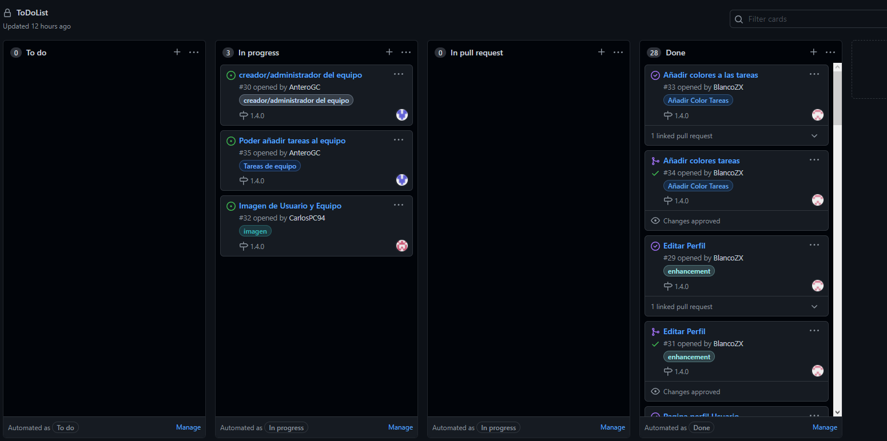

Y por último, en la semana final, los tableros estaban completos:

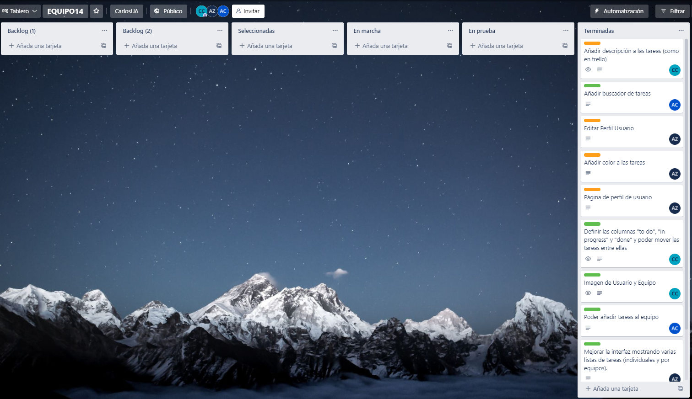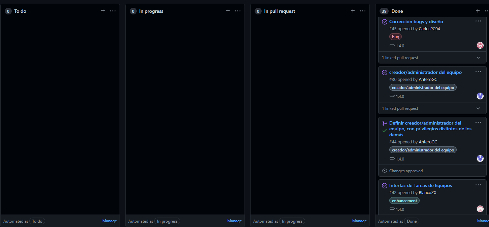

###Métrica sobre el desarrollo

Tomaremos como métrica el número de pull request semanales:

- En la primera semana se realizaron 2 PR: 
  
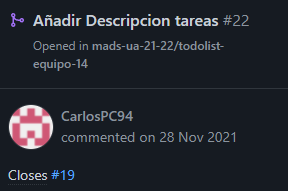 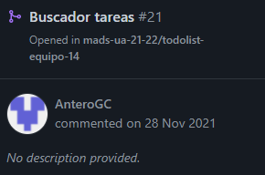

- En la segunda semana, se realizaron 3 PR:

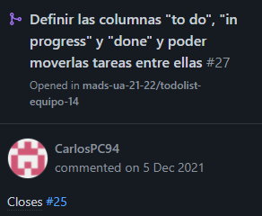 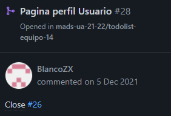 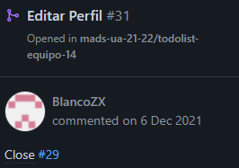

- En la semana número 3, sólo se realizó un PR, durante esa semana se realizaron las dos funcionalidades más duras, que duraron 2 semanas:

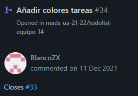

- En la última semana (y los días extra hasta la presentación) se realizaron PR:

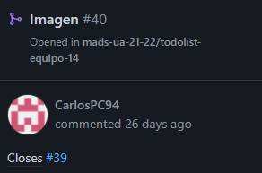 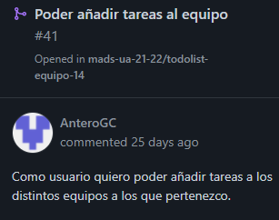 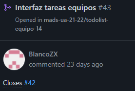 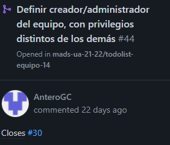

Gráfica:

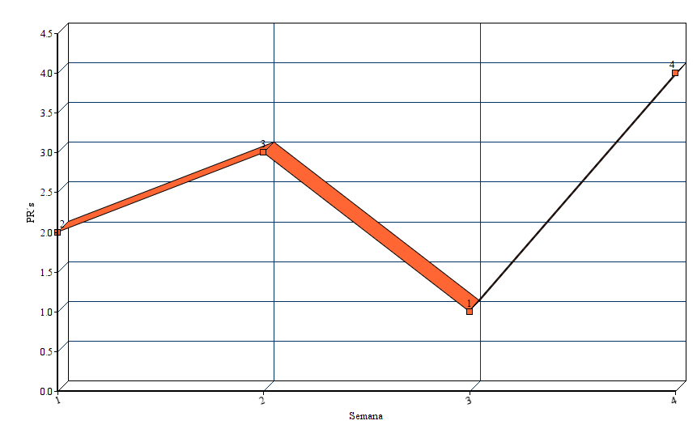

##PAIR PROGRAMMING

Cabe mencionar, que algunas funcionalidades fueron realizadas mediante "Pair Programming". Se realizaron 3 sesiones, que como mínimo debían ser de unos 20 minutos pero se alargaron hasta las 2 horas.

Las funcionalidades realizadas con pair programming fueron:

1. Mejora Interfaz Tareas de equipos:

- Realizada por Adil y Carlos
- Duración: 30 min.
- Herramienta utilizada: "Code with me"

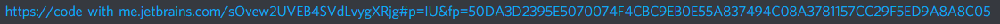
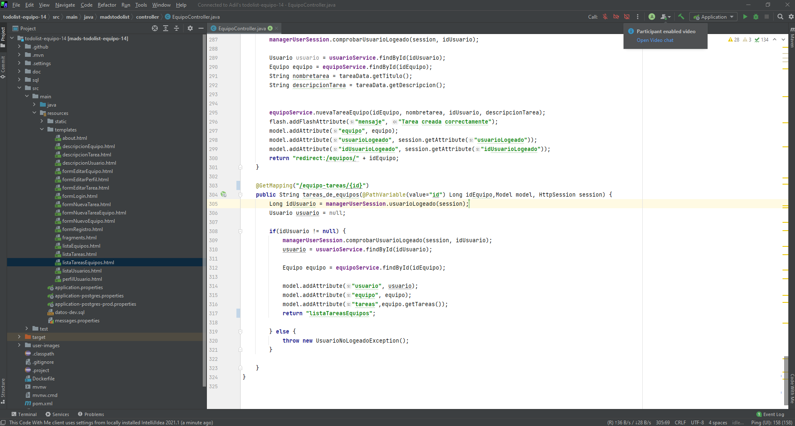

Fue una sesión corta y "Code with me" nos funcionó bastante bien.

2 y 3. Administrador del equipo.

- Realizada por Antero y Carlos
- Duración: (2) 35 min y (3) 2 horas.
- Herramienta utilizada: "Discord"

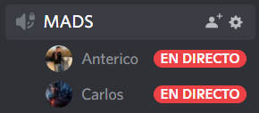
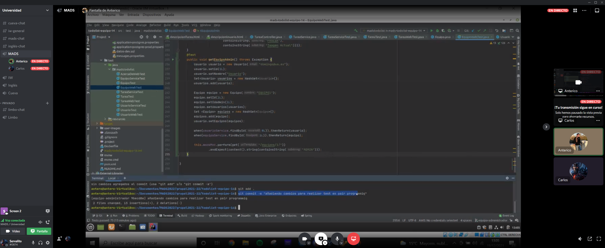
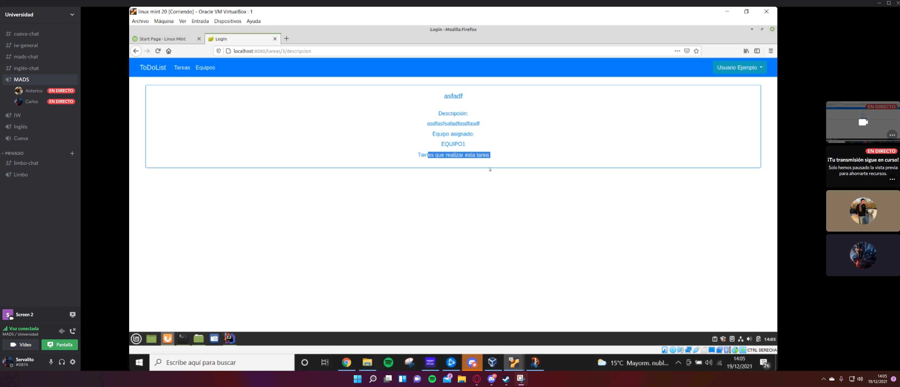

En estas sesiones no pudimos utilizar "Code With me" debido a que Antero trabajaba con Linux Mint y su versión de inteliJ no tenía esta funcionalidad.

#Funcionalidades

## 1. Añadir descripción a Tareas

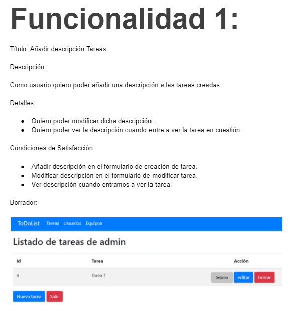
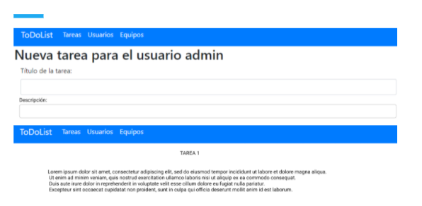

Se trata de una funcionalidad muy sencilla que apenas requiere explicación. En primer lugar se añade el atributo "descripción" al modelo de Tareas. Luego se añade también la descripción en las funciones de "TareaService" y "TareaController" que sean necesarios, por ejemplo:

~~~~
    @Transactional
    public Tarea modificaTarea(Long idTarea, String nuevoTitulo, String descripcion, String estado,String prioridad, Usuario usuario) {
        logger.debug("Modificando tarea " + idTarea + " - " + nuevoTitulo);
        Tarea tarea = tareaRepository.findById(idTarea).orElse(null);
        if (tarea == null) {
            throw new TareaServiceException("No existe tarea con id " + idTarea);
        }
        tarea.setTitulo(nuevoTitulo);
        tarea.setDescripcion(descripcion);
        tarea.setEstado(estado);
        tarea.setPrioridad(prioridad);
        if(tarea.getEquipo()!=null){
            tarea.setUsuario(usuario);
        }
        tareaRepository.save(tarea);
        return tarea;
    }
~~~~
~~~~
    @PostMapping("/usuarios/{id}/tareas/nueva")
    public String nuevaTarea(@PathVariable(value="id") Long idUsuario, @ModelAttribute TareaData tareaData,
                             Model model, RedirectAttributes flash,
                             HttpSession session) {

        managerUserSession.comprobarUsuarioLogeado(session, idUsuario);

        Usuario usuario = usuarioService.findById(idUsuario);
        if (usuario == null) {
            throw new UsuarioNotFoundException();
        }
        tareaService.nuevaTareaUsuario(idUsuario, tareaData.getTitulo(), tareaData.getDescripcion(), tareaData.getEstado(),tareaData.getPrioridad());
        flash.addFlashAttribute("mensaje", "Tarea creada correctamente");
        return "redirect:/usuarios/" + idUsuario + "/tareas";
     }
~~~~

Por ultimo, se modifican los archivos html necesarios, por ejemplo, a la hora de crear una nueva tarea, donde como vemos tambíen se pasa el campo a "TareaData:

~~~~
        

            <label for="descripcion">Descripción de la tarea:</label>
            <input class="form-control" id="descripcion" name="descripcion" th:field="*{descripcion}" type="text"/>
        

~~~~

###Test implementados para comprobar la nueva funcionalidad

###1. editarTareaDevuelveFormEstado()

Un test sencillo, que se ha modificado para hacer la comprobación de la descripción al editar una tarea, mediante el controlador.

~~~~
    @Test
    public void editarTareaDevuelveFormEstado() throws Exception {
        Tarea tarea = new Tarea(new Usuario("domingo@ua.es"), "Tarea de prueba");
        Usuario usuario = new Usuario("domingo@ua.es");
        usuario.setId(1L);
        tarea.setId(1L);
        tarea.getUsuario().setId(1L);
        tarea.setDescripcion("Descripción de prueba");
        tarea.setEstado("To Do");

        when(tareaService.findById(1L)).thenReturn(tarea);
        when(usuarioService.findById(0L)).thenReturn(usuario);

        this.mockMvc.perform(get("/tareas/1/editar"))
                .andExpect(content().string(allOf(
                        // Contiene la acción para enviar el post a la URL correcta
                        containsString("action=\"/tareas/1/editar\""),
                        // Contiene el texto de la tarea a editar
                        containsString("Tarea de prueba"),
                        // Contiene enlace a listar tareas del usuario si se cancela la edición
                        containsString("href=\"/usuarios/1/tareas\""),
                        containsString("To Do"))));
    }
~~~~

### 2. testModificarTarea()

Igual que el test anterior, test sencillo que comprueba que al modificar una tarea mediante el servicio, la descripción se modifique correctamente.

~~~~
    @Test
    @Transactional
    public void testModificarTarea() {
        // GIVEN
        // En el application.properties se cargan los datos de prueba del fichero datos-test.sql

        Tarea tarea = tareaService.nuevaTareaUsuario(1L, "Pagar el recibo", "XX", "To Do","green");
        Long idNuevaTarea = tarea.getId();

        // WHEN

        Tarea tareaModificada = tareaService.modificaTarea(idNuevaTarea, "Pagar la matrícula", "PRUEBA", "To Do","red", null);
        Tarea tareaBD = tareaService.findById(idNuevaTarea);

        // THEN

        assertThat(tareaModificada.getTitulo()).isEqualTo("Pagar la matrícula");
        assertThat(tareaBD.getTitulo()).isEqualTo("Pagar la matrícula");
        assertThat(tareaModificada.getDescripcion()).isEqualTo("PRUEBA");
        assertThat(tareaBD.getDescripcion()).isEqualTo("PRUEBA");
        assertThat(tareaModificada.getEstado()).isEqualTo("To Do");
        assertThat(tareaModificada.getPrioridad()).isEqualTo("red");
        assertThat(tareaBD.getEstado()).isEqualTo("To Do");
        assertThat(tareaBD.getPrioridad()).isEqualTo("red");

    }
~~~~

## 2. Columnas “To Do”, “In progress” y “Done”.

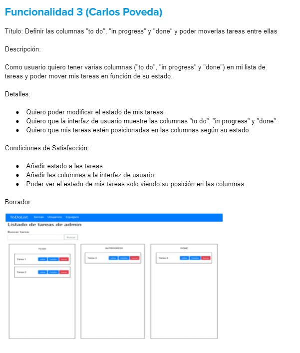

Se trata de una funcionalidad que supuso cierto grado de dificultad. En primer lugar se añadió el atributo "Estado" al Modelo de Tarea, y al igual que con la anterior funcionalidad esto afecto a la mayoría de los Servicios y Controladores, que debían de tratar dicho atributo, como por ejemplo:

~~~~
    @Transactional
    public Tarea modificaTarea(Long idTarea, String nuevoTitulo, String descripcion, String estado,String prioridad, Usuario usuario) {
        logger.debug("Modificando tarea " + idTarea + " - " + nuevoTitulo);
        Tarea tarea = tareaRepository.findById(idTarea).orElse(null);
        if (tarea == null) {
            throw new TareaServiceException("No existe tarea con id " + idTarea);
        }
        tarea.setTitulo(nuevoTitulo);
        tarea.setDescripcion(descripcion);
        tarea.setEstado(estado);
        tarea.setPrioridad(prioridad);
        if(tarea.getEquipo()!=null){
            tarea.setUsuario(usuario);
        }
        tareaRepository.save(tarea);
        return tarea;
    }
~~~~
~~~~
    @GetMapping("/tareas/{id}/editar")
    public String formEditaTarea(@PathVariable(value="id") Long idTarea, @ModelAttribute TareaData tareaData,
                                 Model model, HttpSession session) {

        Long idUsuario = managerUserSession.usuarioLogeado(session);
        Usuario usuario = usuarioService.findById(idUsuario);
        Tarea tarea = tareaService.findById(idTarea);
        List<Equipo> equipos = equipoService.findAllOrderedByName();
        Equipo equipo = null;
        for (int i = 0; i < equipos.size(); i++) {
            if(equipos.get(i).getTareas().contains(tarea)){
                equipo = equipoService.findById(equipos.get(i).getId());
            }
        }
        if (tarea == null) {
            throw new TareaNotFoundException();
        }

        if(equipo != null){
            model.addAttribute("equipo", equipo);
        }
        model.addAttribute("usuario", usuario);
        model.addAttribute("tarea", tarea);
        tareaData.setTitulo(tarea.getTitulo());
        tareaData.setDescripcion(tarea.getDescripcion());
        tareaData.setEstado(tarea.getEstado());
        tareaData.setPrioridad(tarea.getPrioridad());

        return "formEditarTarea";
    }
~~~~

Lo más complicado sin duda fue el html, ya que se trata de una tarea prácticamente de interfaz. Adjuntaré el fragmento de código de la columna "To Do" únicamente, ya que es demasiado código y no merece la pena mostrarlo completamente:

~~~~

                

                    

                        <h5 class="card-title">To Do</h5>
                        <table class="table table-hover">
                            <tbody>
                            <tr th:if="${tarea.getEstado() == 'To Do' && tarea.getEquipo()==null}" th:each="tarea: ${tareas} ">

                                <td th:style="'background:'+@{${tarea.getPrioridad()}}+'; border-radius:10px; '"> </td>
                                <td th:text="${tarea.titulo}"></td>
                                <td><a class="btn btn-primary btn-xs" th:href="@{/tareas/{id}/editar(id=${tarea.id})}"/>editar</a>
                                    <a class="btn btn-primary btn-xs" th:href="@{/tareas/{id}/descripcion(id=${tarea.id})}"/>Detalles</a>
                                    <button class="btn btn-danger btn-xs" onmouseover="" style="cursor: pointer;"
                                            th:onclick="'del(\'/tareas/' + ${tarea.id} + '\')'">borrar</button>
                                </td>

                            </tr>
                            </tbody>
                        </table>
                    

                

~~~~

Como se puede ver, se trata de una división en tarjetas, donde realizamos comprobaciones con "th:if" en función del estado de la tarea. Para cambiar de estado la tarea simplemente debemos de editar la tarea y cambiar al estado deseado, y automáticamente la tarea cambiará de columna.

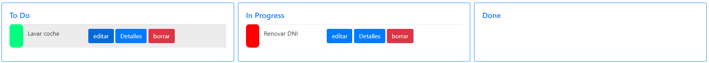
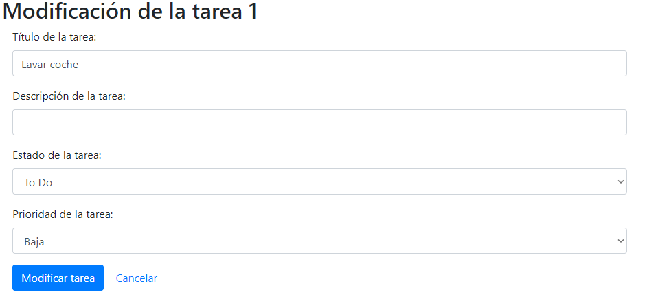

### Test realizados para comprobar la funcionalidad

### 1. getListaTareasDevuelveEstados()

Test sencillo que comprueba si los estados aparecen en la lista de tareas.

~~~~
    @Test
    public void getListaTareasDevuelveEstados() throws Exception {
        Usuario usuario = new Usuario("domingo@ua.es");
        usuario.setId(1L);

        when(usuarioService.findById(1L)).thenReturn(usuario);

        this.mockMvc.perform(get("/usuarios/1/tareas"))
                .andExpect(content().string(allOf(containsString("To Do"),
                        containsString("In Progress"),
                        containsString("Done"))));
    }
~~~~

### 3. getNuevaTareaDevuelveFormEstado()

Test que comprueba que el estado de la tarea sea el mismo que la tarea tiene actualmente una vez entramos dentro de editar tarea.

~~~~
    @Test
    public void getNuevaTareaDevuelveFormEstado() throws Exception {
        Usuario usuario = new Usuario("domingo@ua.es");
        usuario.setId(1L);

        when(usuarioService.findById(1L)).thenReturn(usuario);

        this.mockMvc.perform(get("/usuarios/1/tareas/nueva"))
                .andExpect(content().string(allOf(containsString("action=\"/usuarios/1/tareas/nueva\""),
                        containsString("To Do"))));
    }
~~~~

Además,como se puede comprobar, los test de la funcionalidad anterior, fueron modificados para que también comprobaran el estado de la tarea.

## 3. Imagen de usuarios y equipos.

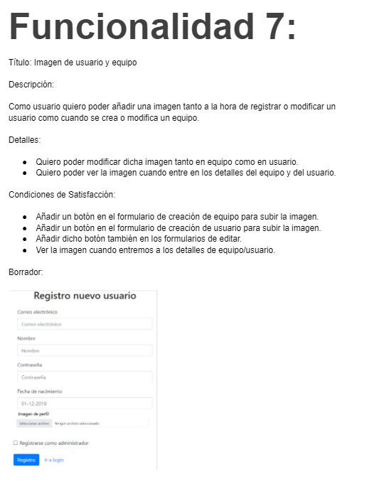
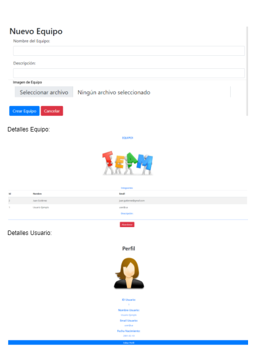

Se trata de la funcionalidad que me supuso más tiempo y esfuerzo, debido a que provocaba numerosos fallos. Como en las anteriores funcionalidades, en primer lugar se añadió el atributo imagen tanto a equipo como a usuario. En este caso no se tuvo que modificar el Servicio, realizando toda la lógica en el Controllador de registro:

~~~~
   @PostMapping("/registro")
   public String registroSubmit(@Valid RegistroData registroData, BindingResult result,
                                Model model, @RequestParam("imagen") MultipartFile multipartFile) throws IOException {

        if (result.hasErrors()) {
            return "formRegistro";
        }

        if (usuarioService.findByEmail(registroData.geteMail()) != null) {
            model.addAttribute("registroData", registroData);
            model.addAttribute("error", "El usuario " + registroData.geteMail() + " ya existe");
            return "formRegistro";
        }

        Usuario usuario = new Usuario(registroData.geteMail());

        usuario.setPassword(registroData.getPassword());
        usuario.setFechaNacimiento(registroData.getFechaNacimiento());
        usuario.setNombre(registroData.getNombre());
        usuario.setAdminApproved(registroData.getAdminApproved());

        String fileName = StringUtils.cleanPath(multipartFile.getOriginalFilename());

        String uploadDir = "./user-images";
        Path uploadPath = Paths.get(uploadDir);

        if(!Files.exists(uploadPath)) {
            Files.createDirectories(uploadPath);
        }

        if(!fileName.equals("")) {
            usuario.setImage(fileName);
            usuarioService.registrar(usuario);
            try (InputStream inputStream = multipartFile.getInputStream()) {
                Path filePath = uploadPath.resolve(fileName);
                Files.copy(inputStream, filePath, StandardCopyOption.REPLACE_EXISTING);
            } catch (IOException e) {
                throw new IOException("Could not save the uploaded file: " + fileName);
            }
        } else {
            usuario.setImage("img.png");
            usuarioService.registrar(usuario);
        }

        return "redirect:/login";
   }
~~~~

Como podemos ver, al guardar las imagenes de los usuarios en nuestro proyecto, el controlador queda muy extenso, pero es bastante intuitivo. En primer lugar obtenemos el nombre del archivo y la ruta donde guardaremos la imagen, una vez lo tenemos comprobamos que no sea null, si es así le asignaremos una imagen por defecto, y en caso contrario subiremos la imagen al servidor y setearemos la imagen a nuestro usuario.

Para que este controlador funcione, es necesario este otro fragmento de código:

~~~~
@Configuration
public class MvcConfig implements WebMvcConfigurer {

    @Override
    public void addResourceHandlers(ResourceHandlerRegistry registry) {
        exposeDirectory("user-images", registry);
    }

    private void exposeDirectory(String dirName, ResourceHandlerRegistry registry) {
        Path uploadDir = Paths.get(dirName);
        String uploadPath = uploadDir.toFile().getAbsolutePath();

        if (dirName.startsWith("../")) dirName = dirName.replace("../", "");

        registry.addResourceHandler("/" + dirName + "/**").addResourceLocations("file:"+ uploadPath + "/");
    }
}
~~~~

Con el cual, damos acceso al directorio especificado, ya que sin esto, las imágenes no se llegan a mostrar nunca.

También se realizaron cambios en el html:

~~~~
<form method="post" enctype="multipart/form-data" th:action="@{/registro}" th:object="${registroData}">
                

                    
                       

                        

                            <label for="imagen">Imagen de perfil</label>
                            <input id="imagen" type="file" name="imagen" class="form-label" accept="image/png, image/jpeg" />
                        

                        

                            

                                
                            

                        
                     
                        <button type="submit" class="btn btn-primary">Registro</button>
                        <a class="btn btn-link" href="/login">Ir a login</a>
                    

~~~~

Es un fragmento del registro, del cual he borrado todos los campos menos la imagen para que no sea tan extenso. Las dos cosas más importantes aquí son "enctype="multipart/form-data"", ya que sin esto, el controlador es incapaz de tratar la imagen, y la etiqueta img con id=thumbnail, que se trata del html de un script de previsualización que cree para que el usuario pudiera ver su imagen antes de subirla definitivamente:

~~~~

~~~~

Algunos ejemplos de donde se muestran imagenes en la aplicación:

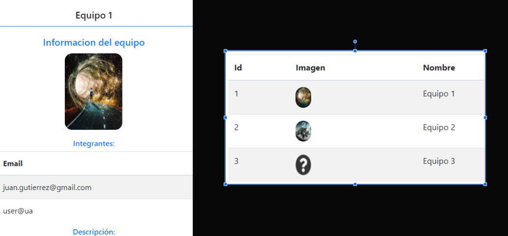
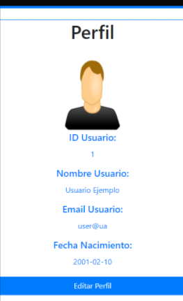
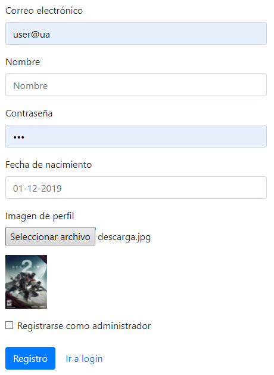

### Test realizados para comprobar la funcionalidad

Los test realizados para la imágenes tuvieron que ser comentados, ya que daban muchos problemas debido al "enctype="multipart/form-data"". Por ejemplo:

~~~~
@Test
    public void postNuevaEquipoDevuelveRedirectYAñadeEquipo() throws Exception {
        Usuario usuario = new Usuario("domingo@ua.es");
        usuario.setId(1L);
        usuario.setNombre("Usuario");

        when(usuarioService.findById(0L)).thenReturn(usuario);

        this.mockMvc.perform(post("/equipos")
                        .param("nombre", "PRUEBA")
                        .param("descripcion", "X")
                        .param("image","XX"))
                .andExpect(status().is3xxRedirection())
                .andExpect(redirectedUrl("/equipos"));

        verify(equipoService).crearEquipo("PRUEBA", "X","XX");
    }
~~~~
## 4. Buscador de tareas.

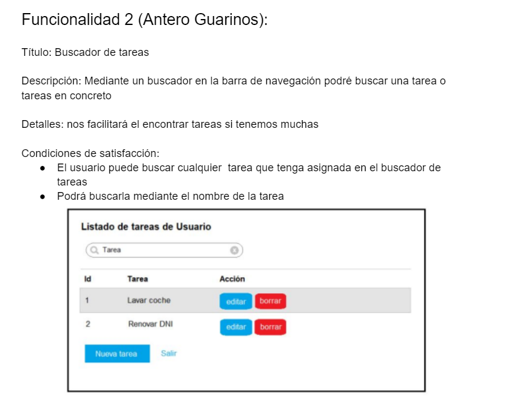
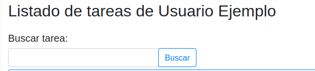

Esta funcionalidad consiste en que el usuario puede buscar
cualquiera de sus tareas que tenga asignadas mediante un buscador. El usuario
podrá buscar la tarea/as escribiendo el nombre de la tarea.

Para llevar a cabo esta funcionalidad hemos añadido el método
‘buscarTarea’ en TareaService . java que lo único que hace es recoger el
nombre a buscar que ha introducido el usuario y el propio usuario

~~~~
@Transactional(readOnly = true)
    public List<Tarea> buscarTarea(String nt, Long idUsuario) {
        Usuario u = usuarioRepository.findById(idUsuario).orElse(null);
        if (u == null) {
            throw new UsuarioServiceException("No existe usuario con id " + idUsuario);
        }
        List<Tarea> tareas = tareaRepository.buscar(nt, u);
        return tareas;
    }
~~~~

En TareaRepository.java hemos añadido una sentencia select que nos
permite recoger de la base de datos cualquier dato que contenga el nombre
que ha escrito el usuario.

~~~~
public interface TareaRepository extends CrudRepository<Tarea, Long> {
    @Query("select t from Tarea t where t.usuario = ?2 and upper(t.titulo) like concat('%', upper(?1), '%')")
    List<Tarea> buscar(String s, Usuario u);
}
~~~~

Además en TareaController.java en su GetMapping correspondiente una
condición que comprueba si el usuario ha escrito algo en el buscador cuando
se accede a esa página (ya que tenemos que diferenciar si el usuario quiere
buscar algo o simplemente quiere ver todas sus tareas).
~~~~
@GetMapping("/usuarios/{id}/tareas")
    public String listadoTareas(@PathVariable(value="id") Long idUsuario, @RequestParam(required = false) String buscador, Model model, HttpSession session, RedirectAttributes flash) {

        managerUserSession.comprobarUsuarioLogeado(session, idUsuario);

        Usuario usuario = usuarioService.findById(idUsuario);
        if (usuario == null) {
            throw new UsuarioNotFoundException();
        }
        List<Tarea> tareas = null;
        if(buscador != null) {

            tareas = tareaService.buscarTarea(buscador, idUsuario);

            if (tareas.size() == 0) {
                flash.addFlashAttribute("mensaje", "No se han encontrado resultados");
                return "redirect:/usuarios/" + idUsuario + "/tareas";
            }
        }
        else{
            tareas = tareaService.allTareasUsuario(idUsuario);
        }

        model.addAttribute("usuario", usuario);
        model.addAttribute("tareas", tareas);
        return "listaTareas";
    }
~~~~
Por último en listaTareas.html hemos añadido un script en el que procesa lo
que el usuario registrado ha escrito y además el nombre que le queremos
pasar al controller
~~~~
function buscarTarea(idUsuario) {
        var buscador = $("#buscar").get(0).value;
        var a = document.getElementById("busqueda");
        var url = "/usuarios/" + idUsuario + "/tareas";
        if(buscador !== ""){
            url = url + "?buscador=" + encodeURIComponent(buscador);
        }
        a.setAttribute('href', url);
    }
~~~~

## 5. Poder añadir tareas al equipo.
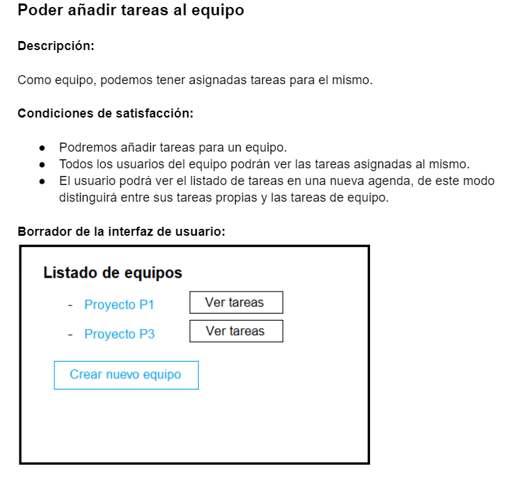

Respecto a la versión anterior, esta nueva funcionalidad es algo
diferente, ya que nos permite añadir tareas a un equipo al cual pertenezcamos.
También podremos visualizar las tareas del equipo actualmente. Anteriormente, el
usuario visualizaba las tareas individuales en su apartado de tareas, estas nuevas
tareas de equipo aparecerán en otro apartado ligado al equipo, en ningún caso se
mezclan las tareas individuales de un usuario con las tareas de los equipos a los que
pertenece.

Técnicamente empezaremos explicando que hemos incluido en la clase
Equipo.java y Tarea.java un Set de tareas y de equipos respectivamente.
Son relaciones de tipo EAGER uno a muchos, ya que un equipo puede tener
muchas tareas pero una tarea solo puede pertenecer a un equipo.

~~~~
//Tareas de Equipo
    @OneToMany(mappedBy = "equipo", fetch = FetchType.EAGER)
    Set<Tarea> tareas = new HashSet<>();
~~~~

~~~~
@ManyToOne
    @JoinColumn(name = "equipo_id")
    private Equipo equipo = null;
~~~~

Para diferenciar entre las tareas de usuarios, implementamos un constructor
nuevo que incluye el Equipo, el cual llamaremos cuando queramos crear una
tarea de equipo.
~~~~
 //constructor para tareas de equipo
    public Tarea(Equipo equipo, String titulo, Usuario usuario, String descripcion) {
        this.equipo = equipo;
        this.usuario = usuario;
        this.titulo = titulo;
        this.estado = "To Do";
        this.descripcion = descripcion;
        if(equipo != null){
            equipo.getTareas().add(this);
        }
        usuario.getTareas().add(this);
    }
~~~~

Siempre que pertenezcamos al equipo tendremos un botón para añadir una
nueva tarea, que nos llevará a un formulario para rellenar los datos de dicha
tarea.

~~~~
@PostMapping("/equipos/{id}/tareas/nueva/{idUsuario}")
    public String nuevaTareaEquipo(@PathVariable(value="id") Long idEquipo, @PathVariable(value="idUsuario") Long idUsuario,
                                   @ModelAttribute TareaData tareaData, Model model,
                                   RedirectAttributes flash, HttpSession session) {
        managerUserSession.comprobarUsuarioLogeado(session, idUsuario);

        Usuario usuario = usuarioService.findById(idUsuario);
        Equipo equipo = equipoService.findById(idEquipo);
        String nombretarea = tareaData.getTitulo();
        Usuario usuarioAsignado = null;
        if (tareaData.getUsuario() != null) {
            usuarioAsignado = usuarioService.findById(tareaData.getUsuario());

        }

        String descripcionTarea = tareaData.getDescripcion();

        equipoService.nuevaTareaEquipo(idEquipo, nombretarea, idUsuario, descripcionTarea, usuarioAsignado, tareaData.getEstado(),tareaData.getPrioridad());

        flash.addFlashAttribute("mensaje", "Tarea creada correctamente");
        model.addAttribute("equipo", equipo);
        model.addAttribute("usuarioLogeado", session.getAttribute("usuarioLogeado"));
        model.addAttribute("idUsuarioLogeado", session.getAttribute("idUsuarioLogeado"));
        return "redirect:/equipo-tareas/" + idEquipo;
        
 ~~~~
 

### Test realizados para comprobar la funcionalidad
Algunos de los test que hemos realizado para comprobar la funcionalidad

~~~~
@Test
    public void getEquipoTareas() throws Exception {
        Usuario usuario = new Usuario("domingo@ua.es");
        Tarea tarea = new Tarea(new Usuario("domingo@ua.es"), "Tarea de prueba");
        Set<Tarea> tareas = new HashSet<Tarea>();

        usuario.setId(1L);
        usuario.setNombre("Usuario");
        Set<Usuario> usuarios = new HashSet<Usuario>();
        usuarios.add(usuario);
        tarea.setId(1L);
        tarea.getUsuario().setId(1L);
        tarea.setDescripcion("Descripción de prueba");
        tareas.add(tarea);

        Equipo equipo = new Equipo("EQUIPO1");
        equipo.setId(1L);
        equipo.setIdadmin(1L);
        equipo.setUsuarios(usuarios);
        equipo.setTareas(tareas);
        Set <Equipo> equipos = new HashSet<Equipo>();
        equipos.add(equipo);
        usuario.setEquipos(equipos);

        when(usuarioService.findById(0L)).thenReturn(usuario);
        when(equipoService.findById(1L)).thenReturn(equipo);

        this.mockMvc.perform(get("/equipos/1/"))
                .andExpect(content().string(allOf(containsString("Tareas del Equipo"),
                        containsString("Tarea de prueba"))));
    }
~~~~
## 6. Definir creador/administrador del equipo, con privilegios distintos de los demás.
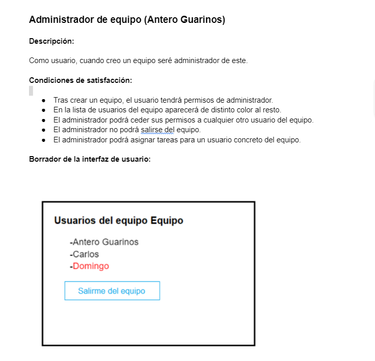
Esta funcionalidad es muy útil para controlar el equipo,
tanto para elegir el administrador como para asignar tareas. Debemos tener en
cuenta que si somos administradores no podremos salirnos del equipo, pero
tenemos la opción de hacer administrador a cualquier miembro que queramos. La
responsabilidad para asignar tareas recae en esta figura.

○ Para añadir esta funcionalidad, en primer lugar añadimos el atributo
administrador en la clase Equipo.java , el cual es de tipo Long, que
corresponde al id del usuario que es administrador. En un principio, el usuario que crea el equipo es el administrador.
~~~~
    @Transactional
    public Equipo crearEquipo(String nombre, String descripcion, String filename, Long idUsuarioAdmin) {
        Equipo equipo = new Equipo(nombre);
        equipo.setDescripcion(descripcion);
        equipo.setImage(filename);
        equipo.setIdAdmin(idUsuarioAdmin);
        equipoRepository.save(equipo);
        return equipo;
    }
 ~~~~
 
 Para la funcionalidad de cambiar el administrador, es necesario crear un
nuevo método en EquipoService.java que se ocupe de cambiar el
administrador, simplemente llamando al setIdAdmin().

~~~~
  @Transactional
    public void hacerAdminEquipo(Long idEquipo, Long idUsuario){
        Usuario usuario = usuarioRepository.findById(idUsuario).orElse(null);
        Equipo equipo = equipoRepository.findById(idEquipo).orElse(null);

        if(usuario == null) {
            throw new EquipoServiceException("Usuario " + idUsuario + " no existe");
        }

        if(equipo == null){
            throw new EquipoServiceException("No existe el equipo con id " + idEquipo);
        }
        equipo.setIdAdmin(idUsuario);
    }
~~~~
Para la asignación de tareas, hemos implementado un método asignarTarea
en la clase TareaService.java que simplemente llama al setUsuario( ) de
tarea si se cumplen las condiciones previas, es decir, que existan tanto dicho
usuario, equipo y tarea. ¿Si le hemos asignado una tarea a un usuario, esta
no saldrá en su agenda de tareas individuales? Así es, pero para solucionarlo
indicamos la condición de que si el equipo de dicha tarea es igual a NULL
muestre dicha tarea, en caso de ser distinto, no lo mostrará, solucionando así
el problema.

Para asignar a alguien una tarea, el administrador del equipo la podrá activar tanto cuando crea una tarea, como cuando la quiere editar. Tan solo tiene que seleccionar el ususario a quien asignarle la tarea del listado de todos los usuarios del equipo.

### Test realizados para comprobar la funcionalidad
Algunos de los test que hemos realizado para comprobar la funcionalidad

~~~~
    @Test
    public void getEquipoAdmin() throws Exception {
        Usuario usuario = new Usuario("domingo@ua.es");
        usuario.setId(1L);
        usuario.setNombre("Usuario");
        Set<Usuario> usuarios = new HashSet<Usuario>();
        usuarios.add(usuario);

        Equipo equipo = new Equipo("EQUIPO1");
        equipo.setId(1L);
        equipo.setIdadmin(1L);
        equipo.setUsuarios(usuarios);
        Set <Equipo> equipos = new HashSet<Equipo>();
        equipos.add(equipo);
        usuario.setEquipos(equipos);

        when(usuarioService.findById(0L)).thenReturn(usuario);
        when(equipoService.findById(1L)).thenReturn(equipo);

        this.mockMvc.perform(get("/equipos/1/"))
                .andExpect(content().string(containsString("ADMIN")));
    }
~~~~

## 7. Perfil Usuario

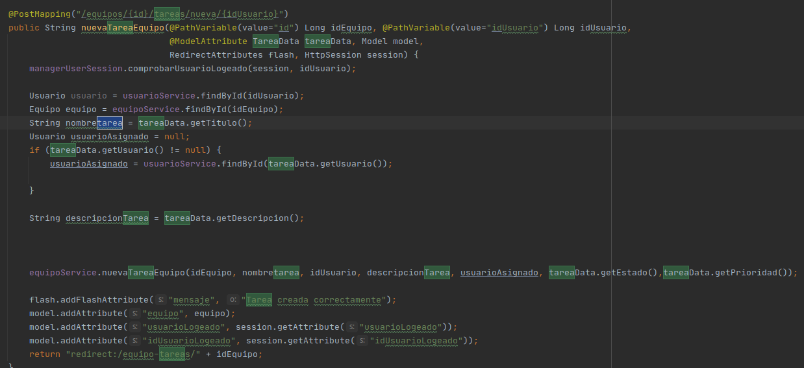

El objetivo de esta funcionalidad ,es que el usuario logueado pueda consultar sus datos de perfil.
Solo ha sido necesario modificar el UserController y añadir una nueva página html para poder visualizar el perfil.
En la parte del controlador se ha añadido los siguiente para poder obtener los datos del usuario logueado y enviar esos
datos al html que muestra la información del usuario logueado.

~~~~
   @GetMapping("/perfil")
    public String perfil_usuario(Model model, HttpSession session) {

        Long idUsuariosession = managerUserSession.usuarioLogeado(session);
        managerUserSession.comprobarUsuarioLogeado(session, idUsuariosession);

        Usuario usuario = usuarioService.findById(idUsuariosession);
        if (usuario == null) {
            throw new UsuarioNotFoundException();
        }
        model.addAttribute("usuario", usuario);
        return "perfilUsuario";
    }
~~~~
Finalmente el perfilUsuario es el html que muestra los datos del usuario pasados desde el contolador.
~~~~

    <h1>Perfil</h1>
        

        
             
            
            <h5 class="card-title">ID Usuario: </h5>
                

            <h5 class="card-title">Nombre Usuario: </h5>
                

            <h5 class="card-title">Email Usuario: </h5>
                

            <h5 class="card-title">Fecha Nacimiento: </h5>
                

        

    <a class="btn btn-primary" th:href="@{/perfil/editar}" >Editar Perfil</a>

~~~~

###Test implementado para esta funcionalidad
El test implementado es bastante sencillo solo comprueba que los datos del usuario se muestran de forma correcta.
~~~~
  @Test
    public void PerfilUsuario() throws Exception {
        Usuario usuario = new Usuario("pedro@ua.es");
        usuario.setNombre("pedro");
        //usuario.setId(5L);
        when(usuarioService.findById(any())).thenReturn(usuario);
        this.mockMvc.perform(get("/perfil"))
                .andExpect(content().string(allOf(containsString("pedro@ua.es"),
                        containsString("Perfil"))));
    }

~~~~

## 8. Editar Perfil Usuario

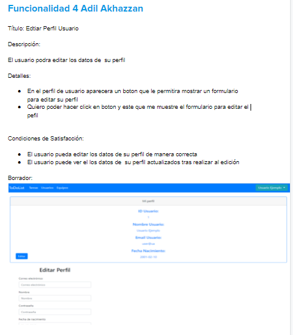

Esta funcionalidad permite al usuario logueado cambiar los datos de su perfil. Para ello se  habilita un botón de edición
desde su perfil que le redirige a un formulario para poder editar sus datos. Para esta funcionalidad se
han modficiado el UserController, UsuarioService y se ha añadido un nuevo formulario para editar el perfil.

En la parte del controlador se ha añaidod lo siguiente:

En esta parte redirige al formulario de editar perfil. Al principio estaba pensado que el formulario de perfil apareciese justo debajo del perfil , pero despues se opto por mostrarlo en otra página aparte.

~~~~

  @GetMapping("/perfil/editar")
    public String editar_perfilForm(Model model, HttpSession session,
                                    @ModelAttribute RegistroData registroData) {

        Long idUsuariosession = managerUserSession.usuarioLogeado(session);
        managerUserSession.comprobarUsuarioLogeado(session, idUsuariosession);

        Usuario usuario = usuarioService.findById(idUsuariosession);
        if (usuario == null) {
            throw new UsuarioNotFoundException();
        }
        model.addAttribute("usuario", usuario);
        registroData.setNombre(usuario.getNombre());
        registroData.seteMail(usuario.getEmail());
        registroData.setFechaNacimiento(usuario.getFechaNacimiento());
        return "formEditarPerfil";

~~~~
####Formulario Editar

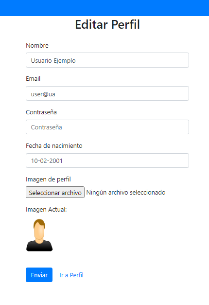

Aqui se encarga de procesar los datos recogidos del formulario para editar los datos de perfil.
~~~~
    @PostMapping("/perfil")
    public String editar_perfil(@Valid RegistroData registroData, BindingResult result, Model model,
                                HttpSession session, @RequestParam("imagen") MultipartFile multipartFile) throws IOException {

        Long idUsuariosession = managerUserSession.usuarioLogeado(session);
        Usuario usuario = usuarioService.findById(idUsuariosession);

        if (result.hasErrors()) {
            return "formEditarPerfil";
        }

        if (usuarioService.findByEmail(registroData.geteMail()) != null && usuarioService.findByEmail(registroData.geteMail()) != usuario) {
            model.addAttribute("registroData", registroData);
            model.addAttribute("error", "El usuario " + registroData.geteMail() + " ya existe");
            return "formEditarPerfil";
        }

        usuario.setPassword(registroData.getPassword());
        usuario.setFechaNacimiento(registroData.getFechaNacimiento());
        usuario.setNombre(registroData.getNombre());
        usuario.setAdminApproved(registroData.getAdminApproved());
        usuario.setEmail(registroData.geteMail());

        model.addAttribute("usuario", usuario);
        
        /// Lo siguiente es para el para la funcionalidad de proceso de imagen
        
        String fileName = StringUtils.cleanPath(multipartFile.getOriginalFilename());
        //usuario.setImage(fileName);

        String uploadDir = "./user-images";
        Path uploadPath = Paths.get(uploadDir);

        if(!Files.exists(uploadPath)) {
            Files.createDirectories(uploadPath);
        }

        if(!fileName.equals("")) {
            try (InputStream inputStream = multipartFile.getInputStream()) {
                Path filePath = uploadPath.resolve(fileName);
                Files.copy(inputStream, filePath, StandardCopyOption.REPLACE_EXISTING);
            } catch (IOException e) {
                throw new IOException("Could not save the uploaded file: " + fileName);
            }
            usuario.setImage(fileName);

        }
        //--> Fin procesamiento de Imagen
        usuarioService.editar_perfil(usuario); //Se llama al servicio que se encagar de editar perfil
        return "redirect:/perfil";
    }
  
    }
~~~~
En la  UsuarioService se ha añadido :
~~~~
    @Transactional
    public Usuario editar_perfil(Usuario usuario) {

        if (usuario.getEmail() == null)
            throw new UsuarioServiceException("El usuario no tiene email");
        else if (usuario.getPassword() == null)
            throw new UsuarioServiceException("El usuario no tiene password");
        else return usuarioRepository.save(usuario);
    }

~~~~
Html implementado para el formulario:
El formulario no tiene nada de especial. Los datos de los input se almacenan en el registro data
para despues ser procesados por el controlador de post.

~~~~
    

        

            <form method="post" enctype="multipart/form-data" th:action="@{/perfil}" th:object="${registroData}">
                

                    

                        

                            <label for="nombre">Nombre</label>
                            <input id="nombre" class="form-control" name="nombre" placeholder="Nombre" type="text"
                                   th:field="*{nombre}"/>
                        

                        

                            <label for="nombre">Email</label>
                            <input id="email" class="form-control" name="email" placeholder="Email" type="text"
                                   th:field="*{eMail}"/>
                        

                        

                            <label for="password">Contraseña</label>
                            <input id="password" class="form-control" name="password" placeholder="Contraseña"
                                   type="password" th:field="*{password}" required/>
                        

                        

                            <label for="fechaNacimiento">Fecha de nacimiento</label>
                            <input id="fechaNacimiento" class="form-control" name="fechaNacimiento"
                                   placeholder="01-12-2019" th:field="*{fechaNacimiento}"/>
                        

                        

                            <label for="imagen">Imagen de perfil</label>
                            <input id="imagen" type="file" name="imagen" class="form-label" accept="image/png, image/jpeg" />
                        

                        <label>Imagen Actual:</label>
                        

                            

                                
                            

                        

                         

                        <button type="submit" class="btn btn-primary">Enviar</button>
                        <a class="btn btn-link" href="/perfil">Ir a Perfil</a>
                    

                

~~~~

###Test implementado para esta funcionalidad:

En este test se comprueba el correcto funcionamiento del  servicio editar perfil.
~~~~
   @Test
    @Transactional
    public void editar_perfil() {
        // GIVEN

        Usuario usuario = usuarioService.findByEmail("user@ua");

        assertThat(usuario.getNombre()).isEqualTo("Usuario Ejemplo");
        usuario.setNombre("Pedro");

        usuario = usuarioService.editar_perfil(usuario);

        assertThat(usuario.getNombre()).isEqualTo("Pedro");
        // THEN
    }

~~~~

## 9. Colores de Tareas
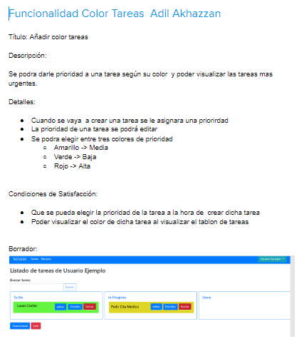

Esta funcionalidad se trata de añadir colores de prioridad a las distintas tareas, para que los usuario sepan
que tareas son mas importantes que otras mediante el color de las mismas.
Para la creacion de esta tarea se ha modificado la clase Tarea y por ende todos los servicios que estan ligados ha esta
para poder reflejar el nuevo dato añadido **prioridad**

~~~~
    private String prioridad;
    
    public String getPrioridad() {
        return prioridad;
    }

    public void setPrioridad(String prioridad) {
        this.prioridad = prioridad;
    }
~~~~
Por ejemplo se ha añadido los siguiente en el servicio nuevaTarea y  modficiarTarea:

~~~~
  @Transactional
    public Tarea nuevaTareaUsuario(Long idUsuario, String tituloTarea, String descripcion, String estado,String prioridad) {
        logger.debug("Añadiendo tarea " + tituloTarea + " al usuario " + idUsuario);
        Usuario usuario = usuarioRepository.findById(idUsuario).orElse(null);
        if (usuario == null) {
            throw new TareaServiceException("Usuario " + idUsuario + " no existe al crear tarea " + tituloTarea);
        }
        Tarea tarea = new Tarea(usuario, tituloTarea);
        tarea.setDescripcion(descripcion);
        tarea.setEstado(estado);
        tarea.setPrioridad(prioridad); -> Añadido el nuevo atributo 
        tareaRepository.save(tarea);
        return tarea;
    }

    @Transactional
    public Tarea modificaTarea(Long idTarea, String nuevoTitulo, String descripcion, String estado,String prioridad, Usuario usuario) {
        logger.debug("Modificando tarea " + idTarea + " - " + nuevoTitulo);
        Tarea tarea = tareaRepository.findById(idTarea).orElse(null);
        if (tarea == null) {
            throw new TareaServiceException("No existe tarea con id " + idTarea);
        }
        tarea.setTitulo(nuevoTitulo);
        tarea.setDescripcion(descripcion);
        tarea.setEstado(estado);
        tarea.setPrioridad(prioridad); ->Añadido el nuevo atributo
        if(tarea.getEquipo()!=null){
            tarea.setUsuario(usuario);
        }
        tareaRepository.save(tarea);
        return tarea;
    }
~~~~
En la parte html del listado de Tareas se ha añadido :
~~~~
//Para indicar que representan los colores
  

    <label th:text="'Prioridad:'" style="font-weight: bold; font-size: 25px"></label> <label style="background: springgreen; color: black; border-radius: 10px; font-size: 20px">Baja</label>
    <label style="background: yellow; color: black; border-radius: 10px; font-size: 20px">Media</label> <label style="background: red; color: white; border-radius: 10px; font-size: 20px">Alta</label>
    

                
 //Para mostrar los coloeres de las tareas               
    <tr th:if="${tarea.getEstado() == 'In Progress'  && tarea.getEquipo()==null}"  th:each="tarea: ${tareas}">
    <td th:style="'background:'+@{${tarea.getPrioridad()}}+'; border-radius:10px; '"> </td>
    <td th:text="${tarea.titulo}" ></td>

~~~~

También se han modificado los seeders de la base de datos para que tengan en cuenta el nuevo atributo:
~~~~

INSERT INTO tareas (id, titulo, usuario_id, estado,prioridad) VALUES('1', 'Lavar coche', '1', 'To Do','springgreen');
INSERT INTO tareas (id, titulo, usuario_id, estado,prioridad) VALUES('2', 'Renovar DNI', '1', 'In Progress','red');
~~~~

###Test implementados
Se han modificados varios test para que se tengan en cuenta  el nuevo atributo, como por ejemplo:
~~~~
    @Test
    @Transactional
    public void testModificarTarea() {
        // GIVEN
        // En el application.properties se cargan los datos de prueba del fichero datos-test.sql

        Tarea tarea = tareaService.nuevaTareaUsuario(1L, "Pagar el recibo", "XX", "To Do","green"); -->Prioridad
        Long idNuevaTarea = tarea.getId();

        // WHEN

        Tarea tareaModificada = tareaService.modificaTarea(idNuevaTarea, "Pagar la matrícula", "PRUEBA", "To Do","red", null);
        Tarea tareaBD = tareaService.findById(idNuevaTarea);

        // THEN

        assertThat(tareaModificada.getTitulo()).isEqualTo("Pagar la matrícula");
        assertThat(tareaBD.getTitulo()).isEqualTo("Pagar la matrícula");
        assertThat(tareaModificada.getDescripcion()).isEqualTo("PRUEBA");
        assertThat(tareaBD.getDescripcion()).isEqualTo("PRUEBA");
        assertThat(tareaModificada.getEstado()).isEqualTo("To Do");
        assertThat(tareaModificada.getPrioridad()).isEqualTo("red"); -->Prioridad
        assertThat(tareaBD.getEstado()).isEqualTo("To Do");
        assertThat(tareaBD.getPrioridad()).isEqualTo("red");

    }
~~~~

## 10. Mejora Interfaz Equipo
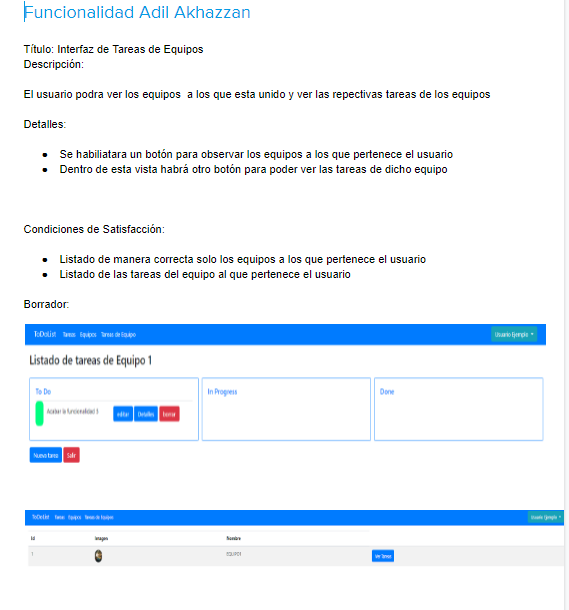

Con esta funcionalidad se buscaba una mejora visual en cuanto al listado de tareas de un equipo.Para ello ha sido necesario crear una nueva
página html parecida al **listar tareasa usuarios** , modifiar el html de listar equipos ,modificar el controlador de equipos para que muestre la nueva página y modificar el servicio de Equipo para
que tenga en cuenta  los nuevos atributos de la tarea.
**listarTareasEquipos**

En el controlador de Equipos se ha añadido :
~~~~
    @GetMapping("/equipo-tareas/{id}")
    public String tareas_de_equipos(@PathVariable(value="id") Long idEquipo,Model model, HttpSession session) {
        Long idUsuario = managerUserSession.usuarioLogeado(session);
        Usuario usuario = null;

        if(idUsuario != null) {
            managerUserSession.comprobarUsuarioLogeado(session, idUsuario);
            usuario = usuarioService.findById(idUsuario);

            Equipo equipo = equipoService.findById(idEquipo);

            model.addAttribute("usuario", usuario);
            model.addAttribute("equipo", equipo);
            model.addAttribute("tareas",equipo.getTareas());
            return "listaTareasEquipos";

        } else {
            throw new UsuarioNoLogeadoException();
        }
~~~~
En la parte de servicio Equipo se ha modificado lo siguiente para que se tenga en cuenta el estado y la prioriraad de la nueva tarea del equipo
~~~~
public Tarea nuevaTareaEquipo(Long idEquipo, String tituloTarea, Long idUsuario, String descripcion,String estado, String  prioridad){
        Equipo equipo = equipoRepository.findById(idEquipo).orElse(null);
        Usuario usuario = usuarioRepository.findById(idUsuario).orElse(null);
        if(equipo == null){
            throw new TareaServiceException("Usuario " + idUsuario + " no existe al crear tarea " + tituloTarea);
        }
        Tarea tarea = new Tarea(equipo, tituloTarea, usuario, descripcion);
        //Nuevos atributos
        tarea.setEstado(estado); 
        tarea.setPrioridad(prioridad);
~~~~

En la parte de html se ha creado la página **listarTareasEquipo** de una forma  similiar en tareas de Usuarios y también se ha creado la página **formNuevaTaresEquipo** para que se tenga en cuenta los nuevos atributos de las tareas de equipo al crearse.

Aqui solamente se muestra la columna inProgress puesto que el código es muy largo.
El funcionamiento de la interfaz ya ha sido explicado con anterioridad en la parte de Usuario, todo es igual excepto que las
tareas se crean para el equipo ,por tanto la nueva tarea se creara en el nuevo formulario **formNuevaTareaEquipo**.
~~~~
         

                    

                        <h5 class="card-title">In Progress</h5>
                        <table class="table table-hover">
                            <tbody>
                            <tr th:if="${tarea.getEstado() == 'In Progress'}"  th:each="tarea: ${tareas}">
                                <td th:style="'background:'+@{${tarea.getPrioridad()}}+'; border-radius:10px; '"> </td>
                                <td th:text="${tarea.titulo}" ></td>

                                <td><a class="btn btn-primary btn-xs" th:href="@{/tareas/{id}/editar(id=${tarea.id})}"/>editar</a>
                                    <a class="btn btn-primary btn-xs" th:href="@{/tareas/{id}/descripcion(id=${tarea.id})}"/>Detalles</a>
                                    <button class="btn btn-danger btn-xs" onmouseover="" style="cursor: pointer;"
                                            th:onclick="'del(\'/tareas/' + ${tarea.id} + '\')'">borrar</button>
                                </td>

                            </tr>
                            </tbody>
                        </table>
                    

~~~~
El nuevo formualrio de nueva tarea de equipo. Es bastante similiar al que teniamos con anterioridad , pero en este caso se tiene en cuenta los nuevos atributos de tareas
que son priorirda y estado.
~~~~
                <label for="descripcion">Descripción de la tarea:</label>
                <input class="form-control" id="descripcion" name="descripcion" th:field="*{descripcion}" type="text"/>
            

            

                <label for="estado">Estado de la tarea:</label>
                <select class="form-control" id="estado" name="estado" required th:field="*{estado}" type="text">
                    <option value="To Do">To Do</option>
                    <option value="In Progress">In Progress</option>
                    <option value="Done">Done</option>
                </select>
            

            

                <label for="prioridad">Prioridad de la tarea:</label>
                <select class="form-control" id="prioridad" name="prioridad" required th:field="*{prioridad}" type="text">
                    <option value="springgreen">Baja</option>
                    <option value="yellow">Media</option>
                    <option value="red">Alta</option>
                </select>
            

            <button class="btn btn-primary" type="submit">Crear tarea</button>

~~~~

En la página de **listar Equipo** se ha añadido:
Se ha utilizado un th:if para especifiar que solo los usuarios que esten unidos a ese equipo puedan acceder al tablero de tareas
~~~~
  <td>
    <a class="btn btn-primary btn-xs" th:href="@{/equipos/{id}(id=${equipo.id})}"/>Ver Equipo</a>
  </td>
  
  <td th:if="${usuario.getEquipos().contains(equipo)}"><a  class="btn btn-primary btn-xs" th:href="@{/equipo-tareas/{id}(id=${equipo.id})}">Tablero de Tareas</a> </td>
~~~~

###Test implementado
En este deste s ecomprueba que se ha añadido
~~~~
 @Test
    public void getTareasEquipo() throws Exception {
        Usuario usuario = new Usuario("domingo@ua.es");
        usuario.setId(1L);
        usuario.setNombre("Usuario");
        Set<Usuario> usuarios = new HashSet<Usuario>();
        usuarios.add(usuario);

        Equipo equipo = new Equipo("EQUIPO1");
        equipo.setId(1L);
        equipo.setUsuarios(usuarios);
        Set <Equipo> equipos = new HashSet<Equipo>();
        equipos.add(equipo);
        usuario.setEquipos(equipos);
        Tarea tarea = new Tarea(equipo,"Limpiar Casa",usuario,"Limpieza rapida");
        tarea.setPrioridad("Baja");
        tarea.setEstado("To Do");

        when(usuarioService.findById(0L)).thenReturn(usuario);
        when(equipoService.findById(1L)).thenReturn(equipo);

        this.mockMvc.perform(get("/equipo-tareas/1/"))
                .andExpect(content().string(containsString("Limpiar Casa")));
    }

~~~~

## 11. Migración de la base de datos

Para la migración de la base da datos se ha creado el siguiente script con los nuevos atributos faltantes
de la base de datos , en la carpeta sql. El script se ejecutó correctamente en el servidor docker  menos la última linea. Lo cual
para solucionarlo tuvimos que entrar en la base de datos del servidor y ejecutarla de manera manual.
Tras esto la migración tuvo éxito

~~~~
ALTER TABLE public.equipos
ADD COLUMN image character varying(64)

Alter Table public.usuarios
add column  image character varying(64),

Alter Table public.tareas
add column  estado character varying(64),
add column  prioridad character varying(64)

alter table tareas alter column usuario_id drop not null;
~~~~

#Retrospectiva

Como grupo, todos estamos de acuerdo en que el trabajo en equipo ha sido un experiencia muy positiva. Todos hemos aprendido los unos de los otros y no hemos tenido problemas a la hora de repartirnos el trabajo o de ayudar a un compañero en caso de que lo necesitase. 

Respecto a la práctica, nos ha servido para acercarnos un poco a un proyecto profesional, siguiendo metodologías que hasta ahora desconocíamos pero que seguro nos servirán en un futuro.