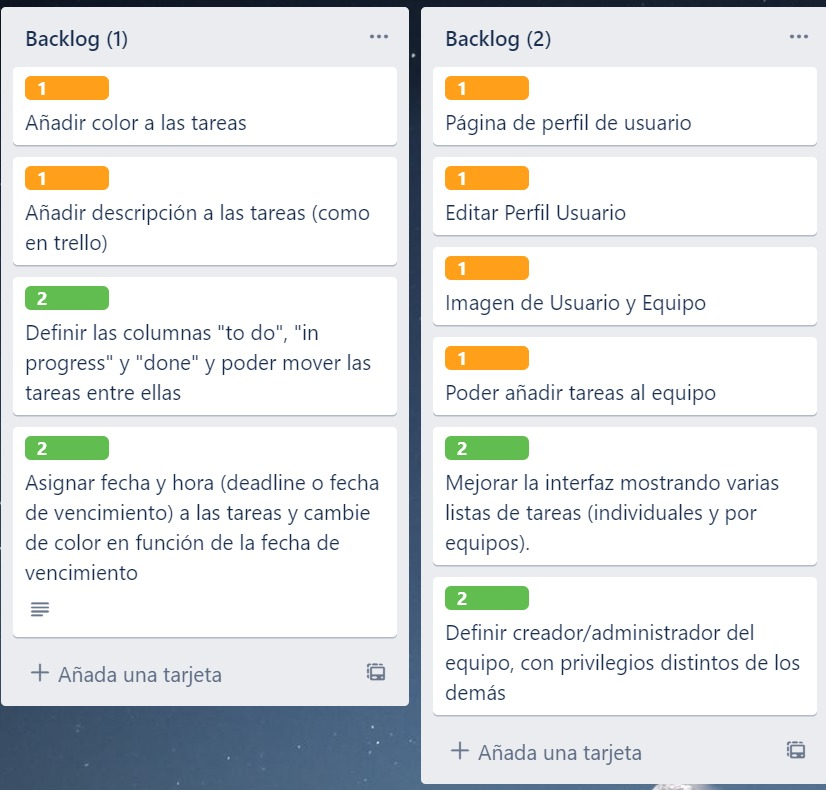

# Práctica 5: Sprint Final
## Equipo 14:
### - Adil Akhazzan
### - Carlos Poveda
### - Antero Guarinos

#

Repositorio de GitHub:
- (https://github.com/mads-ua-21-22/todolist-equipo-14.git)

Repositorio de Docker:
- (https://hub.docker.com/repository/docker/blancozx/mads-todolist-equipo14)

Trello
- (https://trello.com/b/NO2r6D2J/equipo14)

## Metodología Utilizada

En primer lugar, se escogieron las funcionalidades a implementar y se crearon tarjetas en trello donde se indicó su nombre, junto con una breve descripción y fueron clasificadas por dificultad, en nuestro caso las numeramos todas entre 1 y 2.

Una vez escogidas las funcionalidades cada miembro del grupo debía seleccionar la siguiente funcionalidad a realizar, y crear un Google DOC, donde se especificaría la historia de usuario de la funcionalidad junto con sus mockups, y añadir el enlace a la tarjeta de trello asociada a la funcionalidad:

Tras esto la tarjeta de trello se movía a "En marcha" y se procede a crear un ISSUE en Github y la rama donde desarrollaría la funcionalidad, realizando pequeños commits según avanzaba el desarrollo. Al terminar el desarrollo de la funcionalidad, se diseñaron test que comprobar el buen funcionamiento de esta, y una vez que todo funcionara correctamente se realizaba un pull request para mergear la rama de dicha funcionalidad con develop:

El pull request siempre debía ser aceptado por, como mínimo, uno de los demás miembros del equipo:

Cuando la rama había sido mergeada, la tarjeta de trello se movía a "En prueba", además se copiaba en enlace de merge a develop en dicha tarjeta, y otro miembro del grupo distinto al desarrollador de la funcionalidad se encargaría de comprobar el funcionamiento de esta haciendo PULL de la rama develop y probando la funcionalidad desarrollada. En caso de encontrar algún fallo se debía crear de nuevo un ISSUE con su respectiva rama para arreglar los errores. Cuando la funcionalidad estaba terminada y completamente funcional, la tarjeta de trello se pasaba a "Terminadas".

Cabe mencionar, que algunas funcionalidades fueron realizadas mediante "Pair Programming". Se realizaron 3 sesiones, que como mínimo debían ser de unos 20 minutos pero se alargaron hasta las 2 horas.

Las funcionalidades realizadas con pair programming fueron:

1. Mejora Interfaz Tareas de equipos:

- Realizada por Adil y Carlos
- Duración: 30 min.
- Herramienta utilizada: "Code with me"

Fue una sesión corta y "Code with me" nos funcionó bastante bien.

2 y 3. Administrador del equipo.

- Realizada por Antero y Carlos
- Duración: (2) 35 min y (3) 2 horas.
- Herramienta utilizada: "Discord"

En estas sesiones no pudimos utilizar "Code With me" debido a que Antero trabajaba con Linux Mint y su versión de inteliJ no tenía esta funcionalidad.

#Funcionalidades

## 1. Añadir descripción a Tareas

Se trata de una funcionalidad muy sencilla que apenas requiere explicación. En primer lugar se añade el atributo "descripción" al modelo de Tareas. Luego se añade también la descripción en las funciones de "TareaService" y "TareaController" que sean necesarios, por ejemplo:

~~~~
    @Transactional
    public Tarea modificaTarea(Long idTarea, String nuevoTitulo, String descripcion, String estado,String prioridad, Usuario usuario) {
        logger.debug("Modificando tarea " + idTarea + " - " + nuevoTitulo);
        Tarea tarea = tareaRepository.findById(idTarea).orElse(null);
        if (tarea == null) {
            throw new TareaServiceException("No existe tarea con id " + idTarea);
        }
        tarea.setTitulo(nuevoTitulo);
        tarea.setDescripcion(descripcion);
        tarea.setEstado(estado);
        tarea.setPrioridad(prioridad);
        if(tarea.getEquipo()!=null){
            tarea.setUsuario(usuario);
        }
        tareaRepository.save(tarea);
        return tarea;
    }
~~~~
~~~~
    @PostMapping("/usuarios/{id}/tareas/nueva")
    public String nuevaTarea(@PathVariable(value="id") Long idUsuario, @ModelAttribute TareaData tareaData,
                             Model model, RedirectAttributes flash,
                             HttpSession session) {

        managerUserSession.comprobarUsuarioLogeado(session, idUsuario);

        Usuario usuario = usuarioService.findById(idUsuario);
        if (usuario == null) {
            throw new UsuarioNotFoundException();
        }
        tareaService.nuevaTareaUsuario(idUsuario, tareaData.getTitulo(), tareaData.getDescripcion(), tareaData.getEstado(),tareaData.getPrioridad());
        flash.addFlashAttribute("mensaje", "Tarea creada correctamente");
        return "redirect:/usuarios/" + idUsuario + "/tareas";
     }
~~~~

Por ultimo, se modifican los archivos html necesarios, por ejemplo, a la hora de crear una nueva tarea, donde como vemos tambíen se pasa el campo a "TareaData:

~~~~
        

            <label for="descripcion">Descripción de la tarea:</label>
            <input class="form-control" id="descripcion" name="descripcion" th:field="*{descripcion}" type="text"/>
        

~~~~

###Test implementados para comprobar la nueva funcionalidad

###1. editarTareaDevuelveFormEstado()

Un test sencillo, que se ha modificado para hacer la comprobación de la descripción al editar una tarea, mediante el controlador.

~~~~
    @Test
    public void editarTareaDevuelveFormEstado() throws Exception {
        Tarea tarea = new Tarea(new Usuario("domingo@ua.es"), "Tarea de prueba");
        Usuario usuario = new Usuario("domingo@ua.es");
        usuario.setId(1L);
        tarea.setId(1L);
        tarea.getUsuario().setId(1L);
        tarea.setDescripcion("Descripción de prueba");
        tarea.setEstado("To Do");

        when(tareaService.findById(1L)).thenReturn(tarea);
        when(usuarioService.findById(0L)).thenReturn(usuario);

        this.mockMvc.perform(get("/tareas/1/editar"))
                .andExpect(content().string(allOf(
                        // Contiene la acción para enviar el post a la URL correcta
                        containsString("action=\"/tareas/1/editar\""),
                        // Contiene el texto de la tarea a editar
                        containsString("Tarea de prueba"),
                        // Contiene enlace a listar tareas del usuario si se cancela la edición
                        containsString("href=\"/usuarios/1/tareas\""),
                        containsString("To Do"))));
    }
~~~~

### 2. testModificarTarea()

Igual que el test anterior, test sencillo que comprueba que al modificar una tarea mediante el servicio, la descripción se modifique correctamente.

~~~~
    @Test
    @Transactional
    public void testModificarTarea() {
        // GIVEN
        // En el application.properties se cargan los datos de prueba del fichero datos-test.sql

        Tarea tarea = tareaService.nuevaTareaUsuario(1L, "Pagar el recibo", "XX", "To Do","green");
        Long idNuevaTarea = tarea.getId();

        // WHEN

        Tarea tareaModificada = tareaService.modificaTarea(idNuevaTarea, "Pagar la matrícula", "PRUEBA", "To Do","red", null);
        Tarea tareaBD = tareaService.findById(idNuevaTarea);

        // THEN

        assertThat(tareaModificada.getTitulo()).isEqualTo("Pagar la matrícula");
        assertThat(tareaBD.getTitulo()).isEqualTo("Pagar la matrícula");
        assertThat(tareaModificada.getDescripcion()).isEqualTo("PRUEBA");
        assertThat(tareaBD.getDescripcion()).isEqualTo("PRUEBA");
        assertThat(tareaModificada.getEstado()).isEqualTo("To Do");
        assertThat(tareaModificada.getPrioridad()).isEqualTo("red");
        assertThat(tareaBD.getEstado()).isEqualTo("To Do");
        assertThat(tareaBD.getPrioridad()).isEqualTo("red");

    }
~~~~

## 2. Columnas “To Do”, “In progress” y “Done”.

Se trata de una funcionalidad que supuso cierto grado de dificultad. En primer lugar se añadió el atributo "Estado" al Modelo de Tarea, y al igual que con la anterior funcionalidad esto afecto a la mayoría de los Servicios y Controladores, que debían de tratar dicho atributo, como por ejemplo:

~~~~
    @Transactional
    public Tarea modificaTarea(Long idTarea, String nuevoTitulo, String descripcion, String estado,String prioridad, Usuario usuario) {
        logger.debug("Modificando tarea " + idTarea + " - " + nuevoTitulo);
        Tarea tarea = tareaRepository.findById(idTarea).orElse(null);
        if (tarea == null) {
            throw new TareaServiceException("No existe tarea con id " + idTarea);
        }
        tarea.setTitulo(nuevoTitulo);
        tarea.setDescripcion(descripcion);
        tarea.setEstado(estado);
        tarea.setPrioridad(prioridad);
        if(tarea.getEquipo()!=null){
            tarea.setUsuario(usuario);
        }
        tareaRepository.save(tarea);
        return tarea;
    }
~~~~
~~~~
    @GetMapping("/tareas/{id}/editar")
    public String formEditaTarea(@PathVariable(value="id") Long idTarea, @ModelAttribute TareaData tareaData,
                                 Model model, HttpSession session) {

        Long idUsuario = managerUserSession.usuarioLogeado(session);
        Usuario usuario = usuarioService.findById(idUsuario);
        Tarea tarea = tareaService.findById(idTarea);
        List<Equipo> equipos = equipoService.findAllOrderedByName();
        Equipo equipo = null;
        for (int i = 0; i < equipos.size(); i++) {
            if(equipos.get(i).getTareas().contains(tarea)){
                equipo = equipoService.findById(equipos.get(i).getId());
            }
        }
        if (tarea == null) {
            throw new TareaNotFoundException();
        }

        if(equipo != null){
            model.addAttribute("equipo", equipo);
        }
        model.addAttribute("usuario", usuario);
        model.addAttribute("tarea", tarea);
        tareaData.setTitulo(tarea.getTitulo());
        tareaData.setDescripcion(tarea.getDescripcion());
        tareaData.setEstado(tarea.getEstado());
        tareaData.setPrioridad(tarea.getPrioridad());

        return "formEditarTarea";
    }
~~~~

Lo más complicado sin duda fue el html, ya que se trata de una tarea prácticamente de interfaz. Adjuntaré el fragmento de código de la columna "To Do" únicamente, ya que es demasiado código y no merece la pena mostrarlo completamente:

~~~~

                

                    

                        <h5 class="card-title">To Do</h5>
                        <table class="table table-hover">
                            <tbody>
                            <tr th:if="${tarea.getEstado() == 'To Do' && tarea.getEquipo()==null}" th:each="tarea: ${tareas} ">

                                <td th:style="'background:'+@{${tarea.getPrioridad()}}+'; border-radius:10px; '"> </td>
                                <td th:text="${tarea.titulo}"></td>
                                <td><a class="btn btn-primary btn-xs" th:href="@{/tareas/{id}/editar(id=${tarea.id})}"/>editar</a>
                                    <a class="btn btn-primary btn-xs" th:href="@{/tareas/{id}/descripcion(id=${tarea.id})}"/>Detalles</a>
                                    <button class="btn btn-danger btn-xs" onmouseover="" style="cursor: pointer;"
                                            th:onclick="'del(\'/tareas/' + ${tarea.id} + '\')'">borrar</button>
                                </td>

                            </tr>
                            </tbody>
                        </table>
                    

                

~~~~

Como se puede ver, se trata de una división en tarjetas, donde realizamos comprobaciones con "th:if" en función del estado de la tarea. Para cambiar de estado la tarea simplemente debemos de editar la tarea y cambiar al estado deseado, y automáticamente la tarea cambiará de columna.

### Test realizados para comprobar la funcionalidad

### 1. getListaTareasDevuelveEstados()

Test sencillo que comprueba si los estados aparecen en la lista de tareas.

~~~~
    @Test
    public void getListaTareasDevuelveEstados() throws Exception {
        Usuario usuario = new Usuario("domingo@ua.es");
        usuario.setId(1L);

        when(usuarioService.findById(1L)).thenReturn(usuario);

        this.mockMvc.perform(get("/usuarios/1/tareas"))
                .andExpect(content().string(allOf(containsString("To Do"),
                        containsString("In Progress"),
                        containsString("Done"))));
    }
~~~~

### 3. getNuevaTareaDevuelveFormEstado()

Test que comprueba que el estado de la tarea sea el mismo que la tarea tiene actualmente una vez entramos dentro de editar tarea.

~~~~
    @Test
    public void getNuevaTareaDevuelveFormEstado() throws Exception {
        Usuario usuario = new Usuario("domingo@ua.es");
        usuario.setId(1L);

        when(usuarioService.findById(1L)).thenReturn(usuario);

        this.mockMvc.perform(get("/usuarios/1/tareas/nueva"))
                .andExpect(content().string(allOf(containsString("action=\"/usuarios/1/tareas/nueva\""),
                        containsString("To Do"))));
    }
~~~~

Además,como se puede comprobar, los test de la funcionalidad anterior, fueron modificados para que también comprobaran el estado de la tarea.

## 3. Imagen de usuarios y equipos.

Se trata de la funcionalidad que me supuso más tiempo y esfuerzo, debido a que provocaba numerosos fallos. Como en las anteriores funcionalidades, en primer lugar se añadió el atributo imagen tanto a equipo como a usuario. En este caso no se tuvo que modificar el Servicio, realizando toda la lógica en el Controllador de registro:

~~~~
   @PostMapping("/registro")
   public String registroSubmit(@Valid RegistroData registroData, BindingResult result,
                                Model model, @RequestParam("imagen") MultipartFile multipartFile) throws IOException {

        if (result.hasErrors()) {
            return "formRegistro";
        }

        if (usuarioService.findByEmail(registroData.geteMail()) != null) {
            model.addAttribute("registroData", registroData);
            model.addAttribute("error", "El usuario " + registroData.geteMail() + " ya existe");
            return "formRegistro";
        }

        Usuario usuario = new Usuario(registroData.geteMail());

        usuario.setPassword(registroData.getPassword());
        usuario.setFechaNacimiento(registroData.getFechaNacimiento());
        usuario.setNombre(registroData.getNombre());
        usuario.setAdminApproved(registroData.getAdminApproved());

        String fileName = StringUtils.cleanPath(multipartFile.getOriginalFilename());

        String uploadDir = "./user-images";
        Path uploadPath = Paths.get(uploadDir);

        if(!Files.exists(uploadPath)) {
            Files.createDirectories(uploadPath);
        }

        if(!fileName.equals("")) {
            usuario.setImage(fileName);
            usuarioService.registrar(usuario);
            try (InputStream inputStream = multipartFile.getInputStream()) {
                Path filePath = uploadPath.resolve(fileName);
                Files.copy(inputStream, filePath, StandardCopyOption.REPLACE_EXISTING);
            } catch (IOException e) {
                throw new IOException("Could not save the uploaded file: " + fileName);
            }
        } else {
            usuario.setImage("img.png");
            usuarioService.registrar(usuario);
        }

        return "redirect:/login";
   }
~~~~

Como podemos ver, al guardar las imagenes de los usuarios en nuestro proyecto, el controlador queda muy extenso, pero es bastante intuitivo. En primer lugar obtenemos el nombre del archivo y la ruta donde guardaremos la imagen, una vez lo tenemos comprobamos que no sea null, si es así le asignaremos una imagen por defecto, y en caso contrario subiremos la imagen al servidor y setearemos la imagen a nuestro usuario.

Para que este controlador funcione, es necesario este otro fragmento de código:

~~~~
@Configuration
public class MvcConfig implements WebMvcConfigurer {

    @Override
    public void addResourceHandlers(ResourceHandlerRegistry registry) {
        exposeDirectory("user-images", registry);
    }

    private void exposeDirectory(String dirName, ResourceHandlerRegistry registry) {
        Path uploadDir = Paths.get(dirName);
        String uploadPath = uploadDir.toFile().getAbsolutePath();

        if (dirName.startsWith("../")) dirName = dirName.replace("../", "");

        registry.addResourceHandler("/" + dirName + "/**").addResourceLocations("file:"+ uploadPath + "/");
    }
}
~~~~

Con el cual, damos acceso al directorio especificado, ya que sin esto, las imágenes no se llegan a mostrar nunca.

También se realizaron cambios en el html:

~~~~
<form method="post" enctype="multipart/form-data" th:action="@{/registro}" th:object="${registroData}">
                

                    
                       

                        

                            <label for="imagen">Imagen de perfil</label>
                            <input id="imagen" type="file" name="imagen" class="form-label" accept="image/png, image/jpeg" />
                        

                        

                            

                                
                            

                        
                     
                        <button type="submit" class="btn btn-primary">Registro</button>
                        <a class="btn btn-link" href="/login">Ir a login</a>
                    

~~~~

Es un fragmento del registro, del cual he borrado todos los campos menos la imagen para que no sea tan extenso. Las dos cosas más importantes aquí son "enctype="multipart/form-data"", ya que sin esto, el controlador es incapaz de tratar la imagen, y la etiqueta img con id=thumbnail, que se trata del html de un script de previsualización que cree para que el usuario pudiera ver su imagen antes de subirla definitivamente:

~~~~

~~~~

Algunos ejemplos de donde se muestran imagenes en la aplicación:

### Test realizados para comprobar la funcionalidad

Los test realizados para la imágenes tuvieron que ser comentados, ya que daban muchos problemas debido al "enctype="multipart/form-data"". Por ejemplo:

~~~~
@Test
    public void postNuevaEquipoDevuelveRedirectYAñadeEquipo() throws Exception {
        Usuario usuario = new Usuario("domingo@ua.es");
        usuario.setId(1L);
        usuario.setNombre("Usuario");

        when(usuarioService.findById(0L)).thenReturn(usuario);

        this.mockMvc.perform(post("/equipos")
                        .param("nombre", "PRUEBA")
                        .param("descripcion", "X")
                        .param("image","XX"))
                .andExpect(status().is3xxRedirection())
                .andExpect(redirectedUrl("/equipos"));

        verify(equipoService).crearEquipo("PRUEBA", "X","XX");
    }
~~~~
## 4. Buscador de tareas.

Esta funcionalidad consiste en que el usuario puede buscar
cualquiera de sus tareas que tenga asignadas mediante un buscador. El usuario
podrá buscar la tarea/as escribiendo el nombre de la tarea.

Para llevar a cabo esta funcionalidad hemos añadido el método
‘buscarTarea’ en TareaService . java que lo único que hace es recoger el
nombre a buscar que ha introducido el usuario y el propio usuario

~~~~
@Transactional(readOnly = true)
    public List<Tarea> buscarTarea(String nt, Long idUsuario) {
        Usuario u = usuarioRepository.findById(idUsuario).orElse(null);
        if (u == null) {
            throw new UsuarioServiceException("No existe usuario con id " + idUsuario);
        }
        List<Tarea> tareas = tareaRepository.buscar(nt, u);
        return tareas;
    }
~~~~

En TareaRepository.java hemos añadido una sentencia select que nos
permite recoger de la base de datos cualquier dato que contenga el nombre
que ha escrito el usuario.

~~~~
public interface TareaRepository extends CrudRepository<Tarea, Long> {
    @Query("select t from Tarea t where t.usuario = ?2 and upper(t.titulo) like concat('%', upper(?1), '%')")
    List<Tarea> buscar(String s, Usuario u);
}
~~~~

Además en TareaController.java en su GetMapping correspondiente una
condición que comprueba si el usuario ha escrito algo en el buscador cuando
se accede a esa página (ya que tenemos que diferenciar si el usuario quiere
buscar algo o simplemente quiere ver todas sus tareas).
~~~~
@GetMapping("/usuarios/{id}/tareas")
    public String listadoTareas(@PathVariable(value="id") Long idUsuario, @RequestParam(required = false) String buscador, Model model, HttpSession session, RedirectAttributes flash) {

        managerUserSession.comprobarUsuarioLogeado(session, idUsuario);

        Usuario usuario = usuarioService.findById(idUsuario);
        if (usuario == null) {
            throw new UsuarioNotFoundException();
        }
        List<Tarea> tareas = null;
        if(buscador != null) {

            tareas = tareaService.buscarTarea(buscador, idUsuario);

            if (tareas.size() == 0) {
                flash.addFlashAttribute("mensaje", "No se han encontrado resultados");
                return "redirect:/usuarios/" + idUsuario + "/tareas";
            }
        }
        else{
            tareas = tareaService.allTareasUsuario(idUsuario);
        }

        model.addAttribute("usuario", usuario);
        model.addAttribute("tareas", tareas);
        return "listaTareas";
    }
~~~~
Por último en listaTareas.html hemos añadido un script en el que procesa lo
que el usuario registrado ha escrito y además el nombre que le queremos
pasar al controller
~~~~
function buscarTarea(idUsuario) {
        var buscador = $("#buscar").get(0).value;
        var a = document.getElementById("busqueda");
        var url = "/usuarios/" + idUsuario + "/tareas";
        if(buscador !== ""){
            url = url + "?buscador=" + encodeURIComponent(buscador);
        }
        a.setAttribute('href', url);
    }
~~~~

## 5. Poder añadir tareas al equipo.

Respecto a la versión anterior, esta nueva funcionalidad es algo
diferente, ya que nos permite añadir tareas a un equipo al cual pertenezcamos.
También podremos visualizar las tareas del equipo actualmente. Anteriormente, el
usuario visualizaba las tareas individuales en su apartado de tareas, estas nuevas
tareas de equipo aparecerán en otro apartado ligado al equipo, en ningún caso se
mezclan las tareas individuales de un usuario con las tareas de los equipos a los que
pertenece.

Técnicamente empezaremos explicando que hemos incluido en la clase
Equipo.java y Tarea.java un Set de tareas y de equipos respectivamente.
Son relaciones de tipo EAGER uno a muchos, ya que un equipo puede tener
muchas tareas pero una tarea solo puede pertenecer a un equipo.

~~~~
//Tareas de Equipo
    @OneToMany(mappedBy = "equipo", fetch = FetchType.EAGER)
    Set<Tarea> tareas = new HashSet<>();
~~~~

~~~~
@ManyToOne
    @JoinColumn(name = "equipo_id")
    private Equipo equipo = null;
~~~~

Para diferenciar entre las tareas de usuarios, implementamos un constructor
nuevo que incluye el Equipo, el cual llamaremos cuando queramos crear una
tarea de equipo.
~~~~
 //constructor para tareas de equipo
    public Tarea(Equipo equipo, String titulo, Usuario usuario, String descripcion) {
        this.equipo = equipo;
        this.usuario = usuario;
        this.titulo = titulo;
        this.estado = "To Do";
        this.descripcion = descripcion;
        if(equipo != null){
            equipo.getTareas().add(this);
        }
        usuario.getTareas().add(this);
    }
~~~~

Siempre que pertenezcamos al equipo tendremos un botón para añadir una
nueva tarea, que nos llevará a un formulario para rellenar los datos de dicha
tarea.

